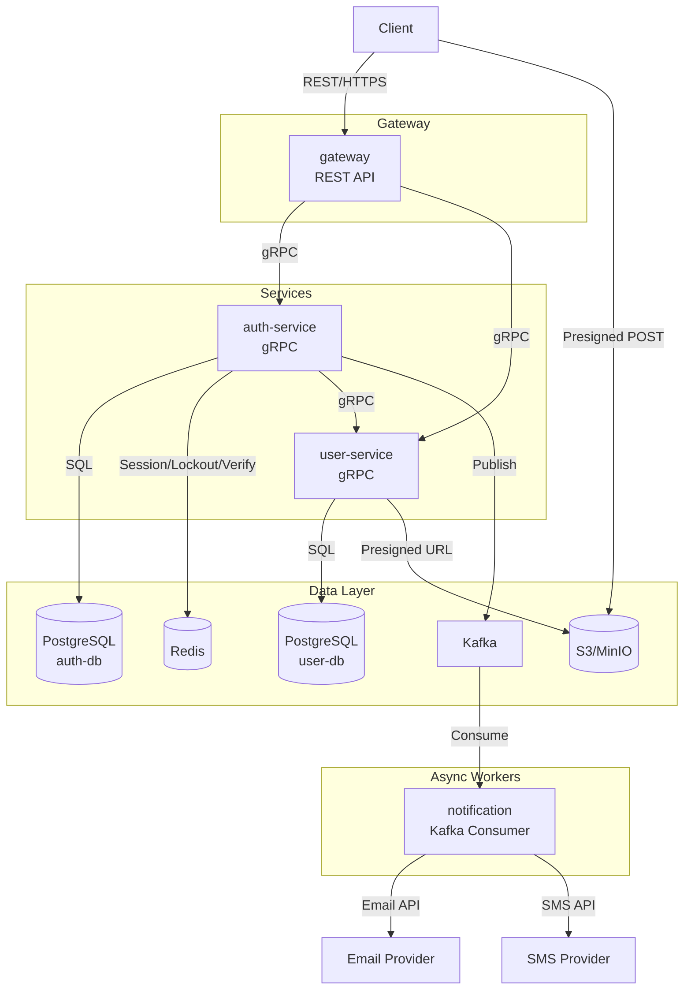

# Backend System Architecture

| Date       | Description                                |
| ---------- | ------------------------------------------ |
| 2026-02-14 | FEAT-USER-001: User Account Management     |

## 1. Overview

nihao-chat is a microservices-based instant messaging application. The backend follows a gateway pattern where a single REST API gateway handles client communication and routes requests to internal gRPC services. Asynchronous processing (e.g., sending emails and SMS) is decoupled via Kafka message queues. User sessions and ephemeral data are managed with Redis, while persistent data resides in PostgreSQL.

## 2. Services

| Name              | Type          | Role                                                                 |
| ----------------- | ------------- | -------------------------------------------------------------------- |
| gateway           | API Gateway   | REST API entry point; JWT validation, rate limiting, request routing  |
| auth-service      | gRPC Service  | Authentication, authorization, token issuance, verification codes     |
| user-service      | gRPC Service  | User CRUD, profile management, avatar presigned URL generation        |
| notification      | Kafka Consumer| Stateless consumer; sends emails and SMS via external providers       |

## 3. Infrastructure

| Component   | Technology    | Purpose                                                              |
| ----------- | ------------- | -------------------------------------------------------------------- |
| Database    | PostgreSQL    | Persistent storage for user data, credentials, and OAuth accounts    |
| Cache       | Redis         | Session storage, account lockout tracking, verification codes, rate limiting |
| Message Queue | Kafka       | Asynchronous notification delivery (email, SMS)                      |
| Object Storage | S3/MinIO   | Avatar image storage                                                 |

## 4. Architecture Diagram

## 5. Service Responsibilities

### 5.1 gateway

- Expose RESTful APIs to clients over HTTPS
- Validate JWT access tokens on protected endpoints
- Enforce rate limiting per endpoint and per IP
- Parse client input to detect identifier type (email vs phone) and pass `identifier_type` + `identifier` downstream
- Route requests to appropriate gRPC backend services
- Return standardized JSON response envelopes to clients
- Handle CORS policy enforcement

### 5.2 auth-service

- Handle user registration (with verification code validation)
- Authenticate users via email/phone + password
- Authenticate users via social login (Google OAuth, Apple Sign-In)
- Issue JWT access tokens and refresh tokens
- Manage refresh token lifecycle in Redis (create, validate, rotate, revoke)
- Generate and validate verification codes (registration, password reset)
- Hash and verify passwords using bcrypt
- Track and enforce account lockout after consecutive failed login attempts (Redis)
- Invalidate all sessions on password reset
- Publish notification events to Kafka (`notification.email`, `notification.sms`)
- Call user-service via gRPC to create users and look up user identifiers

### 5.3 user-service

- Create new user records
- Retrieve user data by ID or by identifier (email/phone)
- Update user profile fields (nickname, bio)
- Generate presigned POST URLs for avatar uploads to S3/MinIO
- Delete avatar images from S3/MinIO
- Serve public profile data for other users

### 5.4 notification

- Consume messages from `notification.email` and `notification.sms` Kafka topics
- Send verification code emails via external email provider API
- Send verification code SMS via external SMS provider API
- Log delivery status for observability (no database persistence)

## 6. Communication Patterns

| From           | To              | Protocol        | Auth/Security                     | Description                                |
| -------------- | --------------- | --------------- | --------------------------------- | ------------------------------------------ |
| Client         | gateway         | REST/HTTPS      | JWT Bearer token (protected endpoints) | Client-facing API                      |
| Client         | S3/MinIO        | HTTPS (Presigned POST) | Presigned URL with S3 policy  | Direct avatar upload                       |
| gateway        | auth-service    | gRPC            | Internal mTLS / service mesh      | Authentication and authorization requests  |
| gateway        | user-service    | gRPC            | Internal mTLS / service mesh      | User data and profile requests             |
| auth-service   | user-service    | gRPC            | Internal mTLS / service mesh      | User creation and identifier lookup        |
| auth-service   | Redis           | Redis protocol  | Password-protected connection     | Session, lockout, and verification storage |
| auth-service   | PostgreSQL      | SQL/TLS         | Username/password + TLS           | Credentials and OAuth account persistence  |
| auth-service   | Kafka           | Kafka protocol  | SASL/TLS                          | Publish notification events                |
| user-service   | PostgreSQL      | SQL/TLS         | Username/password + TLS           | User data persistence                      |
| user-service   | S3/MinIO        | HTTPS           | AWS credentials / service account | Generate presigned POST URLs, delete objects |
| notification   | Kafka           | Kafka protocol  | SASL/TLS                          | Consume notification events                |
| notification   | Email Provider  | HTTPS           | API key                           | Send verification emails                   |
| notification   | SMS Provider    | HTTPS           | API key                           | Send verification SMS                      |

## 7. Security Considerations

- All client-facing traffic is served over HTTPS/TLS
- JWT access tokens are short-lived (15 minutes) to minimize exposure on token theft
- Refresh tokens are stored server-side in Redis with 7-day TTL; not exposed in response bodies beyond initial issuance
- Passwords are hashed with bcrypt before storage; plaintext passwords are never persisted or logged
- Account lockout after 5 consecutive failed login attempts (15-minute lockout window) mitigates brute-force attacks
- Rate limiting is enforced at the gateway layer to prevent abuse on sensitive endpoints (login, registration, password reset)
- Inter-service communication uses mTLS or service mesh to prevent unauthorized internal access
- Verification codes are 6-digit numeric with 10-minute expiry to limit the window for interception
- Presigned POST URLs for avatar uploads enforce size limits (5 MB) and allowed content types (image/jpeg, image/png, image/webp)
- Kafka connections use SASL/TLS for secure event transport
- Database connections use TLS and credential-based authentication
- All sessions are invalidated on password reset to prevent continued access with compromised credentials
- Sensitive data (tokens, passwords, verification codes) is never included in application logs
