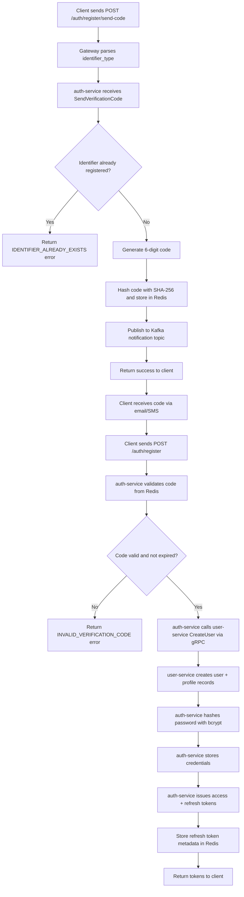
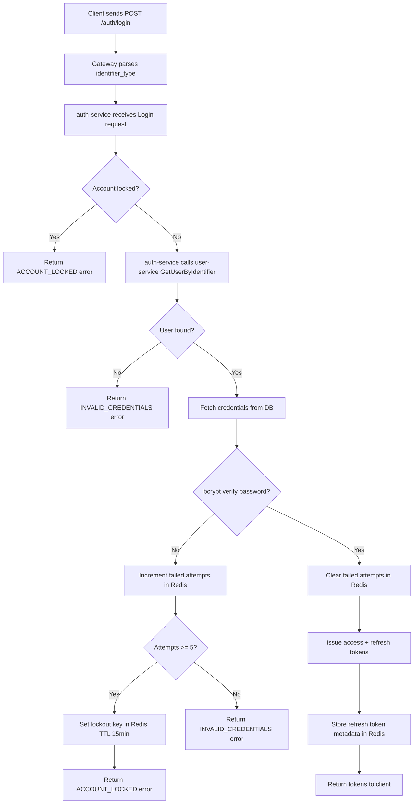
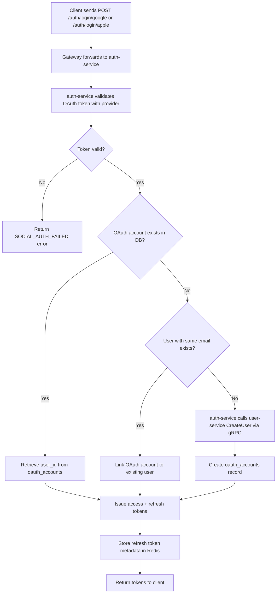
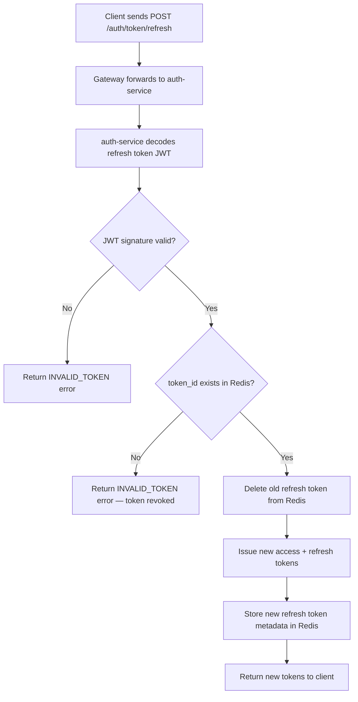
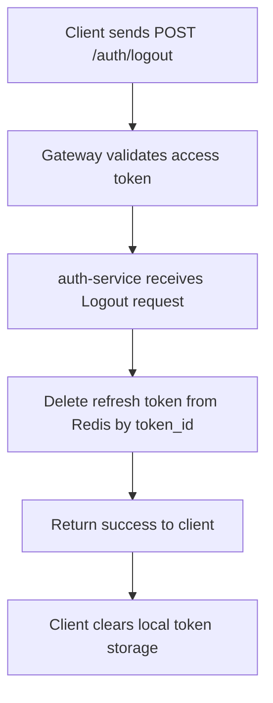
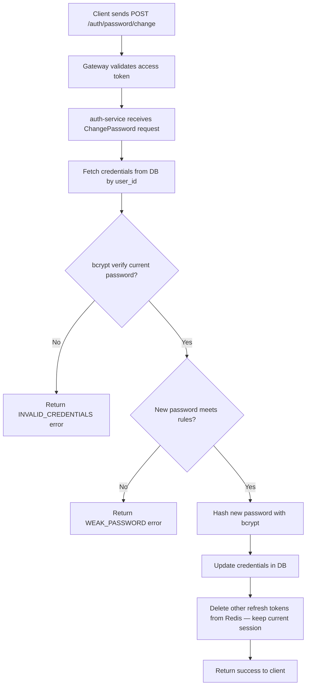
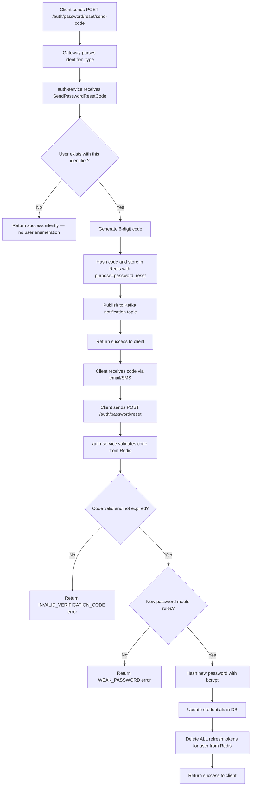

# Authentication Flow

| Date       | Description                                |
| ---------- | ------------------------------------------ |
| 2026-02-14 | FEAT-USER-001: User Account Management     |

## 1. Overview

This document defines the authentication and authorization strategy for nihao-chat. It covers token management, password security, authentication flows, session lifecycle, and security mechanisms. The auth-service is the sole authority for authentication decisions; the gateway validates JWT access tokens for protected endpoints.

## 2. Token Strategy

### 2.1 Token Types

| Token          | Format | Storage              | TTL      | Purpose                                |
| -------------- | ------ | -------------------- | -------- | -------------------------------------- |
| Access Token   | JWT    | Client (memory/storage) | 15 min | Authenticate API requests              |
| Refresh Token  | JWT    | Redis (server-side)  | 7 days   | Obtain new access tokens without login |

### 2.2 Access Token Payload

```json
{
  "iss": "nihao-chat",
  "sub": "550e8400-e29b-41d4-a716-446655440000",
  "role": "user",
  "type": "access",
  "iat": 1700000000,
  "exp": 1700000900
}
```

| Field  | Type   | Description                       |
| ------ | ------ | --------------------------------- |
| `iss`  | string | Token issuer, always `nihao-chat` |
| `sub`  | string | User ID (UUID)                    |
| `role` | string | User role: `user` or `admin`      |
| `type` | string | Token type: `access`              |
| `iat`  | number | Issued at (Unix timestamp)        |
| `exp`  | number | Expiration (Unix timestamp)       |

### 2.3 Refresh Token Payload

```json
{
  "iss": "nihao-chat",
  "sub": "550e8400-e29b-41d4-a716-446655440000",
  "type": "refresh",
  "token_id": "a1b2c3d4-e5f6-7890-abcd-ef1234567890",
  "iat": 1700000000,
  "exp": 1700604800
}
```

| Field      | Type   | Description                                    |
| ---------- | ------ | ---------------------------------------------- |
| `iss`      | string | Token issuer, always `nihao-chat`              |
| `sub`      | string | User ID (UUID)                                 |
| `type`     | string | Token type: `refresh`                          |
| `token_id` | string | Unique token identifier for Redis lookup       |
| `iat`      | number | Issued at (Unix timestamp)                     |
| `exp`      | number | Expiration (Unix timestamp)                    |

### 2.4 Signing Configuration

| Parameter     | Value                |
| ------------- | -------------------- |
| Algorithm     | RS256                |
| Key type      | RSA 2048-bit         |
| Key rotation  | Every 90 days        |
| Key storage   | Environment variable / secrets manager |
| Issuer (`iss`)| `nihao-chat`         |

## 3. Password Security

### 3.1 Hashing Configuration

| Parameter   | Value         |
| ----------- | ------------- |
| Algorithm   | bcrypt        |
| Cost factor | 12            |
| Salt        | Auto-generated by bcrypt |

### 3.2 Password Rules

| Rule                     | Requirement                          |
| ------------------------ | ------------------------------------ |
| Minimum length           | 8 characters                         |
| Maximum length           | 72 characters (bcrypt 72-byte limit) |
| Uppercase letter         | At least 1 uppercase letter (A-Z)    |
| Lowercase letter         | At least 1 lowercase letter (a-z)    |
| Digit                    | At least 1 digit (0-9)               |

### 3.3 Validation Regex

```
^(?=.*[a-z])(?=.*[A-Z])(?=.*\d).{8,72}$
```

## 4. Authentication Flows

### 4.1 Registration Flow



### 4.2 Login Flow (Email/Phone + Password)



### 4.3 Social Login Flow (Google/Apple)



### 4.4 Token Refresh Flow



### 4.5 Logout Flow



### 4.6 Change Password Flow



### 4.7 Password Reset Flow



## 5. Session Lifecycle Summary

```
Register/Login ──▶ Access Token (15min) + Refresh Token (7d)
       │
       ├──▶ API Request ──▶ Gateway validates access token
       │
       ├──▶ Access Token expires ──▶ Client calls /token/refresh
       │         │
       │         ├──▶ Valid refresh ──▶ New Access + Refresh tokens (rotation)
       │         └──▶ Invalid/expired ──▶ Client must re-login
       │
       ├──▶ Logout ──▶ Refresh token deleted from Redis
       │
       ├──▶ Change Password ──▶ OTHER refresh tokens deleted, current session kept
       │
       └──▶ Password Reset ──▶ ALL refresh tokens for user deleted from Redis
```

| Event            | Access Token State | Refresh Token State                |
| ---------------- | ------------------ | ---------------------------------- |
| Login/Register   | Issued (15 min)    | Issued and stored in Redis (7d)    |
| API Request      | Validated by gateway | Unchanged                        |
| Token Refresh    | New token issued   | Old deleted, new stored in Redis   |
| Logout           | Client discards    | Deleted from Redis                 |
| Change Password  | Unchanged          | Other tokens deleted, current kept |
| Password Reset   | Client discards    | All tokens for user deleted        |
| Token Expiry     | Rejected by gateway | Rejected by auth-service          |

## 6. Security Mechanisms

| Mechanism                  | Implementation                                                                                    |
| -------------------------- | ------------------------------------------------------------------------------------------------- |
| Account Lockout            | 5 consecutive failed login attempts → 15-minute lockout; tracked via Redis key `lockout:{identifier}` with TTL |
| Token Rotation             | Each refresh issues a new refresh token and invalidates the old one, preventing replay attacks     |
| Password Hashing           | bcrypt with cost factor 12; plaintext never stored or logged                                      |
| Short-Lived Access Tokens  | 15-minute TTL minimizes exposure window if token is intercepted                                   |
| Server-Side Refresh Tokens | Stored in Redis, not accessible to client after initial issuance; enables server-side revocation  |
| Mass Session Invalidation  | On password reset, all refresh tokens for the user are deleted from Redis; on password change, all other refresh tokens are deleted (current session kept) |
| Rate Limiting              | Gateway enforces per-endpoint, per-IP rate limits on sensitive endpoints                          |
| Verification Code Security | 6-digit codes hashed with SHA-256 before storage; 10-minute expiry; max 5 verification attempts  |
| User Enumeration Prevention| Password reset endpoint returns success regardless of whether the identifier exists               |
| Presigned Upload Security  | Avatar uploads use presigned POST with S3 policy enforcing 5 MB max and allowed MIME types        |
