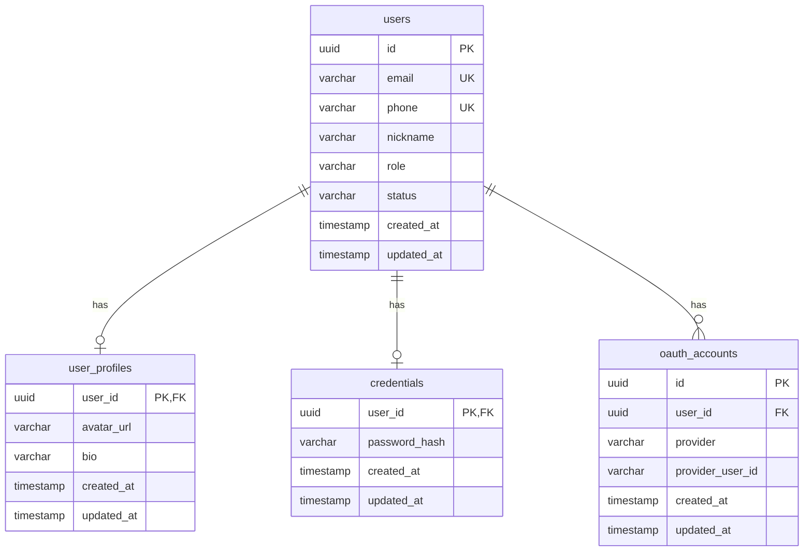

# Database Schema

| Date       | Description                                |
| ---------- | ------------------------------------------ |
| 2026-02-14 | FEAT-USER-001: User Account Management     |

## 1. Overview

This document defines the database schema for nihao-chat backend services. Each service owns its database and tables. Cross-service data access is performed exclusively through gRPC calls, never through direct database queries.

## 2. ER Diagram



## 3. Table Definitions

### 3.1 users

User accounts table. Owned by **user-service**.

| Column     | Type                     | Nullable | Default           | Description                                       |
| ---------- | ------------------------ | -------- | ----------------- | ------------------------------------------------- |
| id         | `UUID`                   | NO       | `gen_random_uuid()` | Primary key                                     |
| email      | `VARCHAR(255)`           | YES      | `NULL`            | Registered email address (unique if set)          |
| phone      | `VARCHAR(20)`            | YES      | `NULL`            | Registered phone number in E.164 format (unique if set) |
| nickname   | `VARCHAR(30)`            | NO       | `''`              | Display name, max 30 characters                   |
| role       | `VARCHAR(20)`            | NO       | `'user'`          | User role: `user`, `admin`                        |
| status     | `VARCHAR(20)`            | NO       | `'active'`        | Account status: `active`, `suspended`, `deleted`  |
| created_at | `TIMESTAMP WITH TIME ZONE` | NO     | `NOW()`           | Record creation timestamp                         |
| updated_at | `TIMESTAMP WITH TIME ZONE` | NO     | `NOW()`           | Last update timestamp                             |

**Constraints:**

- `PK`: `id`
- `UNIQUE`: `email` (partial — `WHERE email IS NOT NULL`)
- `UNIQUE`: `phone` (partial — `WHERE phone IS NOT NULL`)
- `CHECK`: At least one of `email` or `phone` is NOT NULL
- `CHECK`: `role IN ('user', 'admin')`
- `CHECK`: `status IN ('active', 'suspended', 'deleted')`

**Indexes:**

| Name                  | Columns  | Type   | Condition                  |
| --------------------- | -------- | ------ | -------------------------- |
| `idx_users_email`     | `email`  | UNIQUE | `WHERE email IS NOT NULL`  |
| `idx_users_phone`     | `phone`  | UNIQUE | `WHERE phone IS NOT NULL`  |
| `idx_users_status`    | `status` | BTREE  |                            |

**DDL:**

```sql
CREATE TABLE users (
    id          UUID PRIMARY KEY DEFAULT gen_random_uuid(),
    email       VARCHAR(255),
    phone       VARCHAR(20),
    nickname    VARCHAR(30)  NOT NULL DEFAULT '',
    role        VARCHAR(20)  NOT NULL DEFAULT 'user',
    status      VARCHAR(20)  NOT NULL DEFAULT 'active',
    created_at  TIMESTAMP WITH TIME ZONE NOT NULL DEFAULT NOW(),
    updated_at  TIMESTAMP WITH TIME ZONE NOT NULL DEFAULT NOW(),

    CONSTRAINT chk_users_identifier CHECK (email IS NOT NULL OR phone IS NOT NULL),
    CONSTRAINT chk_users_role CHECK (role IN ('user', 'admin')),
    CONSTRAINT chk_users_status CHECK (status IN ('active', 'suspended', 'deleted'))
);

CREATE UNIQUE INDEX idx_users_email ON users (email) WHERE email IS NOT NULL;
CREATE UNIQUE INDEX idx_users_phone ON users (phone) WHERE phone IS NOT NULL;
CREATE INDEX idx_users_status ON users (status);
```

### 3.2 user_profiles

Extended profile information for users. Owned by **user-service**.

| Column     | Type                     | Nullable | Default  | Description                              |
| ---------- | ------------------------ | -------- | -------- | ---------------------------------------- |
| user_id    | `UUID`                   | NO       |          | Primary key and foreign key to `users.id`|
| avatar_url | `VARCHAR(500)`           | YES      | `NULL`   | URL of the user's avatar image in S3     |
| bio        | `VARCHAR(200)`           | YES      | `NULL`   | Personal bio, max 200 characters         |
| created_at | `TIMESTAMP WITH TIME ZONE` | NO     | `NOW()`  | Record creation timestamp                |
| updated_at | `TIMESTAMP WITH TIME ZONE` | NO     | `NOW()`  | Last update timestamp                    |

**Constraints:**

- `PK`: `user_id`
- `FK`: `user_id` → `users(id)` ON DELETE CASCADE

**DDL:**

```sql
CREATE TABLE user_profiles (
    user_id     UUID PRIMARY KEY,
    avatar_url  VARCHAR(500),
    bio         VARCHAR(200),
    created_at  TIMESTAMP WITH TIME ZONE NOT NULL DEFAULT NOW(),
    updated_at  TIMESTAMP WITH TIME ZONE NOT NULL DEFAULT NOW(),

    CONSTRAINT fk_user_profiles_user FOREIGN KEY (user_id) REFERENCES users(id) ON DELETE CASCADE
);
```

### 3.3 credentials

Password credentials for users. Owned by **auth-service**.

| Column        | Type                     | Nullable | Default  | Description                                  |
| ------------- | ------------------------ | -------- | -------- | -------------------------------------------- |
| user_id       | `UUID`                   | NO       |          | Primary key; references `users.id` logically |
| password_hash | `VARCHAR(255)`           | NO       |          | bcrypt-hashed password                       |
| created_at    | `TIMESTAMP WITH TIME ZONE` | NO     | `NOW()`  | Record creation timestamp                    |
| updated_at    | `TIMESTAMP WITH TIME ZONE` | NO     | `NOW()`  | Last update timestamp                        |

**Constraints:**

- `PK`: `user_id`

> Note: `user_id` references `users.id` logically but is not enforced via FK since the `users` table resides in a separate database owned by user-service. Referential integrity is maintained at the application layer.

**DDL:**

```sql
CREATE TABLE credentials (
    user_id       UUID PRIMARY KEY,
    password_hash VARCHAR(255) NOT NULL,
    created_at    TIMESTAMP WITH TIME ZONE NOT NULL DEFAULT NOW(),
    updated_at    TIMESTAMP WITH TIME ZONE NOT NULL DEFAULT NOW()
);
```

### 3.4 oauth_accounts

Third-party OAuth account linkages. Owned by **auth-service**.

| Column           | Type                     | Nullable | Default             | Description                                    |
| ---------------- | ------------------------ | -------- | ------------------- | ---------------------------------------------- |
| id               | `UUID`                   | NO       | `gen_random_uuid()` | Primary key                                    |
| user_id          | `UUID`                   | NO       |                     | Associated user ID (logical reference)         |
| provider         | `VARCHAR(20)`            | NO       |                     | OAuth provider: `google`, `apple`              |
| provider_user_id | `VARCHAR(255)`           | NO       |                     | User ID from the OAuth provider                |
| created_at       | `TIMESTAMP WITH TIME ZONE` | NO     | `NOW()`             | Record creation timestamp                      |
| updated_at       | `TIMESTAMP WITH TIME ZONE` | NO     | `NOW()`             | Last update timestamp                          |

**Constraints:**

- `PK`: `id`
- `UNIQUE`: (`provider`, `provider_user_id`)

**Indexes:**

| Name                             | Columns                          | Type   |
| -------------------------------- | -------------------------------- | ------ |
| `idx_oauth_accounts_user_id`     | `user_id`                        | BTREE  |
| `uq_oauth_provider_user`         | (`provider`, `provider_user_id`) | UNIQUE |

**DDL:**

```sql
CREATE TABLE oauth_accounts (
    id               UUID PRIMARY KEY DEFAULT gen_random_uuid(),
    user_id          UUID         NOT NULL,
    provider         VARCHAR(20)  NOT NULL,
    provider_user_id VARCHAR(255) NOT NULL,
    created_at       TIMESTAMP WITH TIME ZONE NOT NULL DEFAULT NOW(),
    updated_at       TIMESTAMP WITH TIME ZONE NOT NULL DEFAULT NOW(),

    CONSTRAINT uq_oauth_provider_user UNIQUE (provider, provider_user_id)
);

CREATE INDEX idx_oauth_accounts_user_id ON oauth_accounts (user_id);
```

## 4. Service Ownership

| Table              | Primary Service  | Access                                                    |
| ------------------ | ---------------- | --------------------------------------------------------- |
| users              | user-service     | Read/Write by user-service; read via gRPC by auth-service |
| user_profiles      | user-service     | Read/Write by user-service only                           |
| credentials        | auth-service     | Read/Write by auth-service only                           |
| oauth_accounts     | auth-service     | Read/Write by auth-service only                           |

## 5. Auto-Updated Timestamps

### 5.1 Trigger Function

```sql
CREATE OR REPLACE FUNCTION update_updated_at_column()
RETURNS TRIGGER AS $$
BEGIN
    NEW.updated_at = NOW();
    RETURN NEW;
END;
$$ LANGUAGE plpgsql;
```

### 5.2 Per-Table Triggers

```sql
-- user-service database
CREATE TRIGGER trg_users_updated_at
    BEFORE UPDATE ON users
    FOR EACH ROW
    EXECUTE FUNCTION update_updated_at_column();

CREATE TRIGGER trg_user_profiles_updated_at
    BEFORE UPDATE ON user_profiles
    FOR EACH ROW
    EXECUTE FUNCTION update_updated_at_column();

-- auth-service database
CREATE TRIGGER trg_credentials_updated_at
    BEFORE UPDATE ON credentials
    FOR EACH ROW
    EXECUTE FUNCTION update_updated_at_column();

CREATE TRIGGER trg_oauth_accounts_updated_at
    BEFORE UPDATE ON oauth_accounts
    FOR EACH ROW
    EXECUTE FUNCTION update_updated_at_column();
```

