# Gateway REST API Specification

| Date       | Description                                                          |
| ---------- | -------------------------------------------------------------------- |
| 2026-02-20 | Update error translation to use Google standard error detail types   |
| 2026-02-14 | FEAT-USER-001: User Account Management                               |

## 1. Overview

This document defines the REST API exposed by the nihao-chat gateway service. The gateway is the single entry point for all client requests. It validates JWT tokens, enforces rate limits, detects identifier types (email vs phone), and routes requests to internal gRPC services.

## 2. Versioning

All API routes use the prefix `/api/v1/`. When a breaking change is required, a new version prefix (e.g., `/api/v2/`) will be introduced while maintaining backward compatibility on the previous version.

## 3. Common Headers

| Header             | Value                          | Required | Description                                      |
| ------------------ | ------------------------------ | -------- | ------------------------------------------------ |
| `content-type`     | `application/json`             | Yes      | Request/response content type                    |
| `authorization`    | `Bearer {access_token}`        | Protected| JWT access token for authenticated endpoints     |
| `x-request-id`     | UUID string                    | No       | Client-generated request ID for tracing; server generates if absent |
| `x-idempotency-key`| UUID string                    | Conditional | Required for critical POST/PATCH operations   |
| `accept-language`  | `en`, `zh`, etc.               | No       | Preferred language for error messages            |

## 4. Response Format

All responses use the standard JSON envelope with `snake_case` field names:

```go
type ErrorItem struct {
    Field       string `json:"field,omitempty"`
    Description string `json:"description,omitempty"`
    Reason      string `json:"reason,omitempty"`
}

type Response struct {
    Data      interface{} `json:"data,omitempty"`
    Errors    []ErrorItem `json:"errors,omitempty"`
    RequestID string      `json:"request_id"`
}
```

**Success Response (with data):**

```json
{
  "data": { ... },
  "request_id": "req-abc123"
}
```

**Success Response (no data — e.g., logout, password change):**

```json
{
  "request_id": "req-abc123"
}
```

**Error Response:**

```json
{
  "errors": [
    {"reason": "Invalid credentials"}
  ],
  "request_id": "req-abc123"
}
```

**Error Response (field-level):**

```json
{
  "errors": [
    {"field": "identifier", "description": "Invalid email format"},
    {"field": "password", "description": "Password must be at least 8 characters"}
  ],
  "request_id": "req-abc123"
}
```

| Field        | Type              | Description                                              |
| ------------ | ----------------- | -------------------------------------------------------- |
| `data`       | object (omitempty) | Response payload; omitted on error or when no data       |
| `errors`     | []ErrorItem (omitempty)     | Array of error items; BadRequest uses `field` + `description`, other errors use `reason`; omitted on success |
| `request_id` | string            | Unique request identifier for tracing                    |

## 5. HTTP Status Code Usage

| Status Code | Meaning                  | Used When                                                    |
| ----------- | ------------------------ | ------------------------------------------------------------ |
| 200         | OK                       | Successful GET, PATCH, DELETE, or POST that returns data      |
| 201         | Created                  | Successful resource creation (registration)                   |
| 400         | Bad Request              | Validation error, invalid input                               |
| 401         | Unauthorized             | Missing/invalid/expired token, wrong credentials              |
| 403         | Forbidden                | Valid token but insufficient permissions                      |
| 404         | Not Found                | Resource does not exist                                       |
| 409         | Conflict                 | Duplicate resource or idempotency conflict                    |
| 429         | Too Many Requests        | Rate limit exceeded                                           |
| 500         | Internal Server Error    | Unexpected server failure                                     |
| 503         | Service Unavailable      | Downstream service temporarily unavailable                    |
| 504         | Gateway Timeout          | Request processing timed out                                  |

### 5.1 gRPC-to-HTTP Error Translation

The gateway translates gRPC errors to REST responses by:

1. Mapping the gRPC status code to the appropriate HTTP status code (see table below)
2. Extracting Google standard error detail types from the gRPC status to determine the `errors` field format

**gRPC Status to HTTP Mapping:**

| gRPC Status        | HTTP Status |
| ------------------ | ----------- |
| OK                 | 200         |
| INVALID_ARGUMENT   | 400         |
| UNAUTHENTICATED    | 401         |
| PERMISSION_DENIED  | 403         |
| NOT_FOUND          | 404         |
| ALREADY_EXISTS     | 409         |
| RESOURCE_EXHAUSTED | 429         |
| INTERNAL           | 500         |
| UNAVAILABLE        | 503         |
| DEADLINE_EXCEEDED  | 504         |

**Error Detail to `errors` Format:**

| Condition                              | `errors` format                                      |
| -------------------------------------- | ---------------------------------------------------- |
| gRPC status contains `BadRequest` detail | Array — field violations mapped to `[{"field": "field_name", "description": "..."}, ...]` |
| All other cases (ErrorInfo, ResourceInfo, etc. or no detail) | Array — `[{"reason": "the gRPC status message"}]`  |

## 6. Pagination

### 6.1 Cursor-Based Pagination

Used for real-time or frequently updated lists (e.g., messages, notifications):

| Parameter    | Type   | Description                                |
| ------------ | ------ | ------------------------------------------ |
| `page_token` | string | Opaque token for the next page (from previous response) |
| `page_size`  | integer| Number of items per page (default: 20, max: 100) |

**Paginated Response:**

```json
{
  "data": {
    "items": [ ... ],
    "next_page_token": "eyJ..."
  },
  "request_id": "req-abc123"
}
```

### 6.2 Offset-Based Pagination

Used for stable, sortable lists (e.g., admin user lists, search results):

| Parameter   | Type    | Description                                |
| ----------- | ------- | ------------------------------------------ |
| `page`      | integer | Page number (1-based, default: 1)          |
| `page_size` | integer | Number of items per page (default: 20, max: 100) |

**Paginated Response:**

```json
{
  "data": {
    "items": [ ... ],
    "total": 150,
    "page": 2,
    "page_size": 20
  },
  "request_id": "req-abc123"
}
```

## 7. Authentication & Authorization

### 7.1 Endpoint Access Levels

| Access Level | Description                                                  |
| ------------ | ------------------------------------------------------------ |
| Public       | No authentication required. Accessible by anyone.             |
| Protected    | Requires valid JWT access token in `authorization` header.    |

### 7.2 Role Definitions

| Role    | Description                                                      |
| ------- | ---------------------------------------------------------------- |
| `user`  | Standard authenticated user. Default role after registration.     |
| `admin` | Administrative user with elevated permissions.                    |

### 7.3 Access Matrix

| Endpoint                              | Public | user | admin |
| ------------------------------------- | ------ | ---- | ----- |
| `POST /api/v1/auth/register/send-code`| Yes    | —    | —     |
| `POST /api/v1/auth/register`          | Yes    | —    | —     |
| `POST /api/v1/auth/login`             | Yes    | —    | —     |
| `POST /api/v1/auth/login/google`      | Yes    | —    | —     |
| `POST /api/v1/auth/login/apple`       | Yes    | —    | —     |
| `POST /api/v1/auth/token/refresh`     | Yes    | —    | —     |
| `POST /api/v1/auth/logout`            | —      | Yes  | Yes   |
| `POST /api/v1/auth/password/change`   | —      | Yes  | Yes   |
| `POST /api/v1/auth/password/reset/send-code` | Yes | — | —    |
| `POST /api/v1/auth/password/reset`    | Yes    | —    | —     |
| `GET /api/v1/users/me`                | —      | Yes  | Yes   |
| `PATCH /api/v1/users/me`              | —      | Yes  | Yes   |
| `GET /api/v1/users/:id/profile`       | —      | Yes  | Yes   |
| `POST /api/v1/users/me/avatar/presigned` | —   | Yes  | Yes   |
| `DELETE /api/v1/users/me/avatar`      | —      | Yes  | Yes   |

## 8. CORS Policy

| Setting                    | Value                                          |
| -------------------------- | ---------------------------------------------- |
| `access-control-allow-origin` | Configured per environment (specific origins) |
| `access-control-allow-methods` | `GET, POST, PATCH, DELETE, OPTIONS`          |
| `access-control-allow-headers` | `content-type, authorization, x-request-id, x-idempotency-key` |
| `access-control-allow-credentials` | `true`                                   |
| `access-control-max-age`  | `86400` (24 hours)                              |

## 9. Idempotency

Critical POST and PATCH operations should include the `x-idempotency-key` header to prevent duplicate processing. The gateway stores idempotency keys in Redis with a 24-hour TTL.

| Behavior                              | Description                                                       |
| ------------------------------------- | ----------------------------------------------------------------- |
| First request with key                | Processed normally; response cached with key                      |
| Duplicate request with same key       | Returns cached response without reprocessing                      |
| Key format                            | UUID v4                                                            |
| Key TTL                               | 24 hours                                                           |
| Missing key on critical endpoint      | Request processed but without idempotency protection               |

## 10. Rate Limiting

| Endpoint Category          | Limit           | Window   |
| -------------------------- | --------------- | -------- |
| Auth endpoints (login, register, password reset) | 10 requests | 1 minute |
| Verification code sending  | 3 requests      | 1 minute |
| Token refresh              | 30 requests     | 1 minute |
| Profile endpoints          | 60 requests     | 1 minute |
| Default (all others)       | 120 requests    | 1 minute |

**Rate Limit Response Headers:**

| Header                  | Description                                        |
| ----------------------- | -------------------------------------------------- |
| `x-ratelimit-limit`    | Maximum requests allowed in the current window     |
| `x-ratelimit-remaining`| Remaining requests in the current window           |
| `x-ratelimit-reset`    | Unix timestamp when the rate limit window resets   |

**Rate Limit Exceeded Response (HTTP 429):**

```json
{
  "errors": [
    {"reason": "Rate limit exceeded. Please try again later."}
  ],
  "request_id": "req-abc123"
}
```

## 11. Endpoints

### 11.1 Registration

#### 11.1.1 Send Registration Verification Code

`POST /api/v1/auth/register/send-code`

- **Access:** Public
- **Idempotency:** Recommended
- **Description:** Sends a 6-digit verification code to the provided email or phone number for registration. The gateway detects the identifier type and passes `identifier_type` downstream.

**Request Body:**

```json
{
  "identifier": "user@example.com"
}
```

| Field        | Type   | Required | Validation                              |
| ------------ | ------ | -------- | --------------------------------------- |
| `identifier` | string | Yes      | Valid email address or E.164 phone number |

**Success Response (200):**

```json
{
  "data": {
    "expires_in": 600
  },
  "request_id": "req-abc123"
}
```

**Error Responses:**

| HTTP Status | errors                      |
| ----------- | ----------------------------------- |
| 400         | Invalid identifier format           |
| 409         | Identifier already registered       |
| 429         | Too many verification code requests |

**Sequence Diagram:**

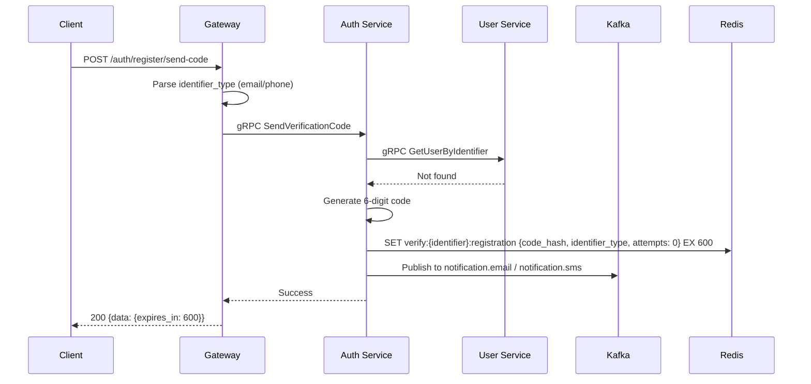

#### 11.1.2 Register

`POST /api/v1/auth/register`

- **Access:** Public
- **Idempotency:** Required
- **Description:** Completes user registration by verifying the code and creating the account with password and nickname.

**Request Body:**

```json
{
  "identifier": "user@example.com",
  "code": "123456",
  "password": "MyPass123",
  "nickname": "John"
}
```

| Field        | Type   | Required | Validation                                      |
| ------------ | ------ | -------- | ----------------------------------------------- |
| `identifier` | string | Yes      | Valid email or E.164 phone number               |
| `code`       | string | Yes      | 6-digit numeric string                          |
| `password`   | string | Yes      | 8–72 chars, must include upper + lower + digit |
| `nickname`   | string | Yes      | 1–30 characters                                 |

**Success Response (201):**

```json
{
  "data": {
    "user_id": "550e8400-e29b-41d4-a716-446655440000",
    "access_token": "eyJhbGciOiJSUzI1NiIs...",
    "refresh_token": "eyJhbGciOiJSUzI1NiIs...",
    "expires_in": 900
  },
  "request_id": "req-abc123"
}
```

**Error Responses:**

| HTTP Status | errors                      |
| ----------- | ----------------------------------- |
| 400         | Invalid verification code           |
| 400         | Password does not meet requirements |
| 400         | Invalid nickname                    |
| 400         | Validation error                    |
| 409         | Identifier already registered       |

**Sequence Diagram:**

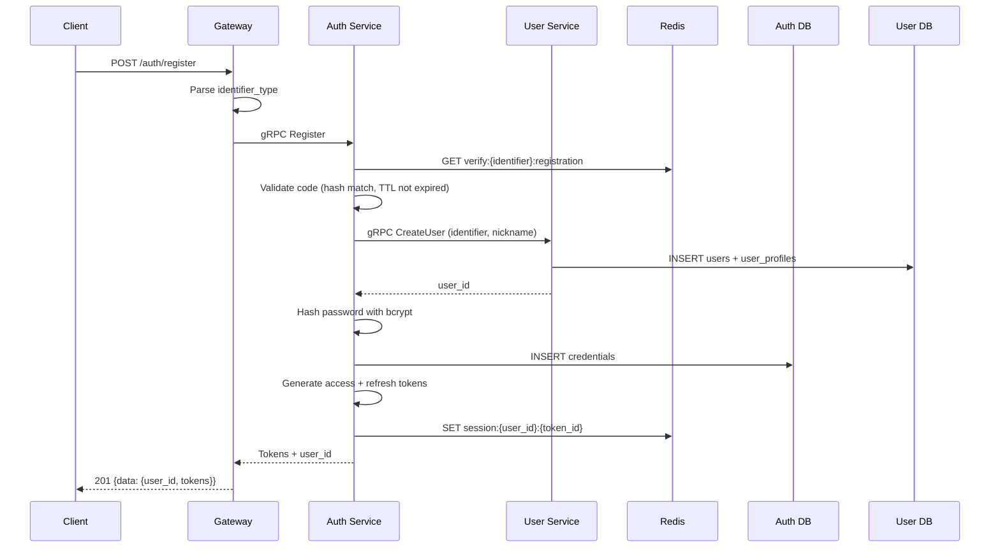

### 11.2 Login

#### 11.2.1 Login with Email/Phone + Password

`POST /api/v1/auth/login`

- **Access:** Public
- **Idempotency:** Not required
- **Description:** Authenticates a user with their email/phone and password.

**Request Body:**

```json
{
  "identifier": "user@example.com",
  "password": "MyPass123"
}
```

| Field        | Type   | Required | Validation                              |
| ------------ | ------ | -------- | --------------------------------------- |
| `identifier` | string | Yes      | Valid email or E.164 phone number       |
| `password`   | string | Yes      | Non-empty string                        |

**Success Response (200):**

```json
{
  "data": {
    "user_id": "550e8400-e29b-41d4-a716-446655440000",
    "access_token": "eyJhbGciOiJSUzI1NiIs...",
    "refresh_token": "eyJhbGciOiJSUzI1NiIs...",
    "expires_in": 900
  },
  "request_id": "req-abc123"
}
```

**Error Responses:**

| HTTP Status | errors      |
| ----------- | ------------------- |
| 400         | Validation error    |
| 401         | Invalid credentials |
| 403         | Account locked      |

**Sequence Diagram:**

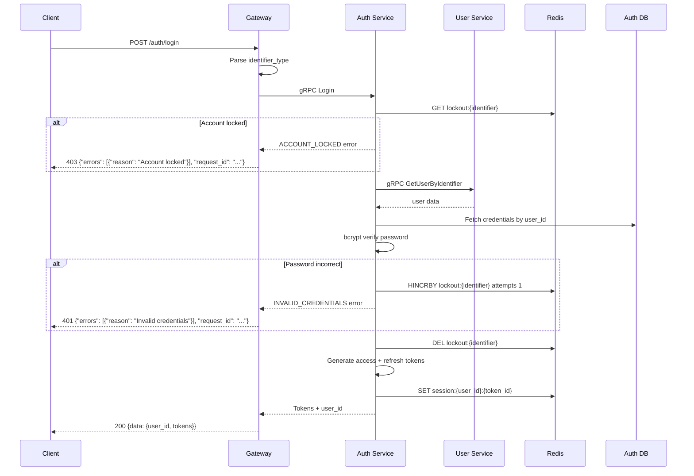

#### 11.2.2 Login with Google

`POST /api/v1/auth/login/google`

- **Access:** Public
- **Idempotency:** Not required
- **Description:** Authenticates a user via Google OAuth. Creates an account if the user does not exist.

**Request Body:**

```json
{
  "id_token": "eyJhbGciOiJSUzI1NiIs..."
}
```

| Field      | Type   | Required | Validation            |
| ---------- | ------ | -------- | --------------------- |
| `id_token` | string | Yes      | Valid Google ID token  |

**Success Response (200):**

```json
{
  "data": {
    "user_id": "550e8400-e29b-41d4-a716-446655440000",
    "access_token": "eyJhbGciOiJSUzI1NiIs...",
    "refresh_token": "eyJhbGciOiJSUzI1NiIs...",
    "expires_in": 900,
    "is_new_user": false
  },
  "request_id": "req-abc123"
}
```

**Error Responses:**

| HTTP Status | errors                       |
| ----------- | ------------------------------------ |
| 400         | Validation error                     |
| 401         | Google authentication failed         |

**Sequence Diagram:**

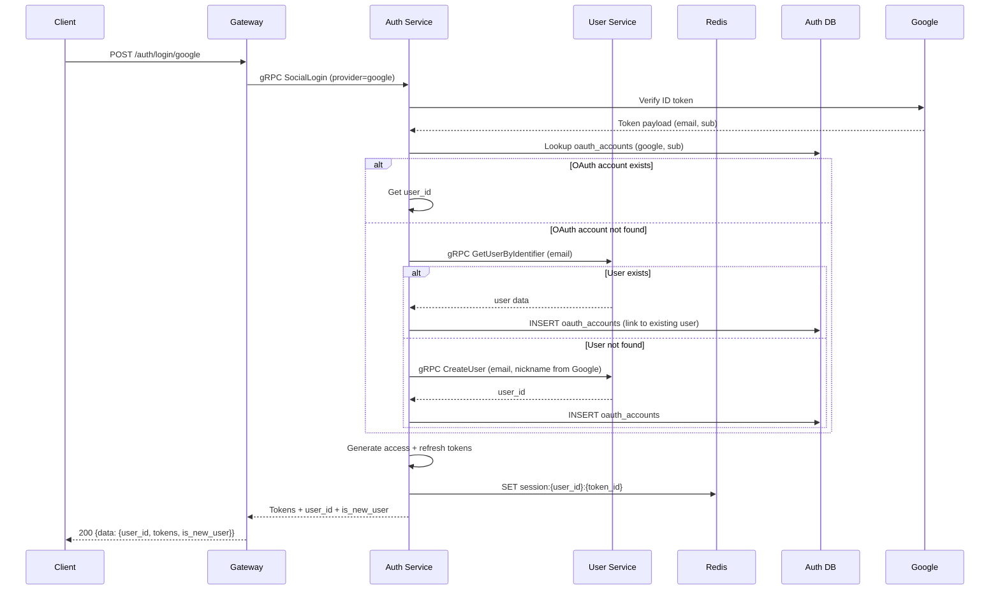

#### 11.2.3 Login with Apple

`POST /api/v1/auth/login/apple`

- **Access:** Public
- **Idempotency:** Not required
- **Description:** Authenticates a user via Apple Sign-In. Creates an account if the user does not exist.

**Request Body:**

```json
{
  "id_token": "eyJhbGciOiJSUzI1NiIs...",
  "authorization_code": "c1234567890"
}
```

| Field                | Type   | Required | Validation                   |
| -------------------- | ------ | -------- | ---------------------------- |
| `id_token`           | string | Yes      | Valid Apple ID token          |
| `authorization_code` | string | Yes      | Apple authorization code      |

**Success Response (200):**

```json
{
  "data": {
    "user_id": "550e8400-e29b-41d4-a716-446655440000",
    "access_token": "eyJhbGciOiJSUzI1NiIs...",
    "refresh_token": "eyJhbGciOiJSUzI1NiIs...",
    "expires_in": 900,
    "is_new_user": false
  },
  "request_id": "req-abc123"
}
```

**Error Responses:**

| HTTP Status | errors                      |
| ----------- | ----------------------------------- |
| 400         | Validation error                    |
| 401         | Apple authentication failed         |

**Sequence Diagram:**

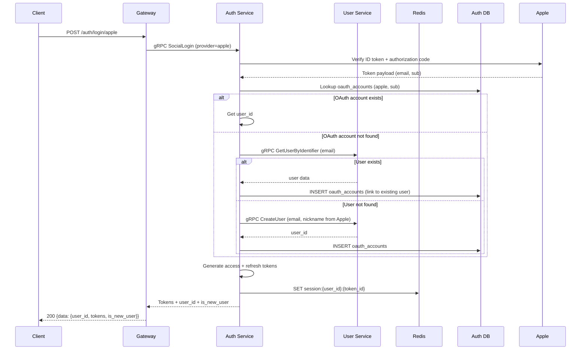

### 11.3 Token

#### 11.3.1 Refresh Token

`POST /api/v1/auth/token/refresh`

- **Access:** Public
- **Idempotency:** Not required
- **Description:** Exchanges a valid refresh token for a new access token and refresh token (token rotation).

**Request Body:**

```json
{
  "refresh_token": "eyJhbGciOiJSUzI1NiIs..."
}
```

| Field           | Type   | Required | Validation         |
| --------------- | ------ | -------- | ------------------ |
| `refresh_token` | string | Yes      | Valid JWT string   |

**Success Response (200):**

```json
{
  "data": {
    "access_token": "eyJhbGciOiJSUzI1NiIs...",
    "refresh_token": "eyJhbGciOiJSUzI1NiIs...",
    "expires_in": 900
  },
  "request_id": "req-abc123"
}
```

**Error Responses:**

| HTTP Status | errors   |
| ----------- | ---------------- |
| 400         | Validation error |
| 401         | Invalid token    |
| 401         | Token expired    |

**Sequence Diagram:**

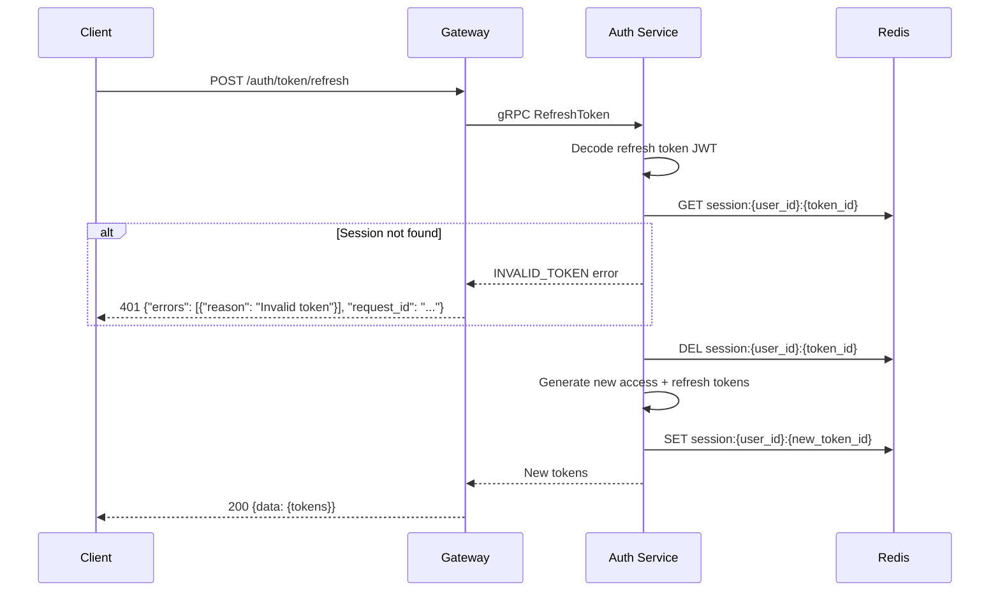

### 11.4 Logout

#### 11.4.1 Logout

`POST /api/v1/auth/logout`

- **Access:** Protected (user)
- **Idempotency:** Not required
- **Description:** Terminates the current session by revoking the refresh token.

**Request Body:**

```json
{
  "refresh_token": "eyJhbGciOiJSUzI1NiIs..."
}
```

| Field           | Type   | Required | Validation         |
| --------------- | ------ | -------- | ------------------ |
| `refresh_token` | string | Yes      | Valid JWT string   |

**Success Response (200):**

```json
{
  "request_id": "req-abc123"
}
```

**Error Responses:**

| HTTP Status | errors |
| ----------- | -------------- |
| 401         | Unauthorized   |

**Sequence Diagram:**

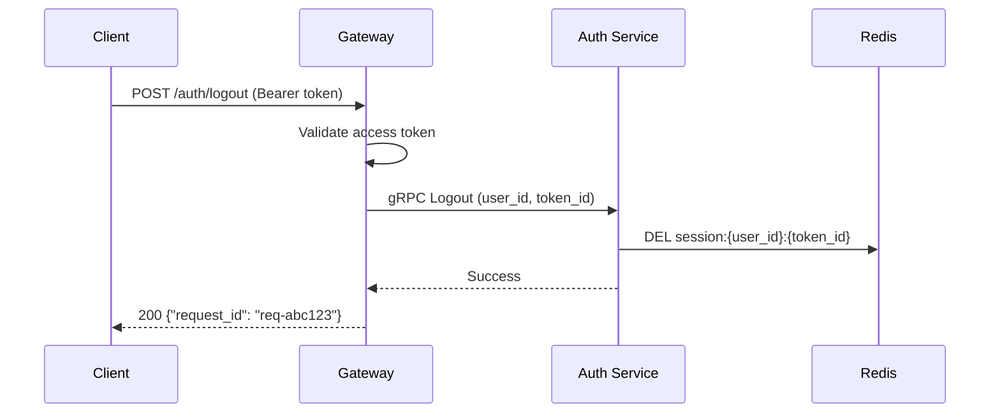

### 11.5 Password Management

#### 11.5.1 Change Password

`POST /api/v1/auth/password/change`

- **Access:** Protected (user)
- **Idempotency:** Recommended
- **Description:** Changes the current user's password after verifying the current password.

**Request Body:**

```json
{
  "current_password": "MyOldPass123",
  "new_password": "MyNewPass456"
}
```

| Field              | Type   | Required | Validation                                      |
| ------------------ | ------ | -------- | ----------------------------------------------- |
| `current_password` | string | Yes      | Non-empty string                                |
| `new_password`     | string | Yes      | 8–72 chars, must include upper + lower + digit |

**Success Response (200):**

```json
{
  "request_id": "req-abc123"
}
```

**Error Responses:**

| HTTP Status | errors                      |
| ----------- | ----------------------------------- |
| 400         | Password does not meet requirements |
| 400         | New password same as current        |
| 401         | Current password is incorrect       |
| 401         | Unauthorized                        |

**Sequence Diagram:**

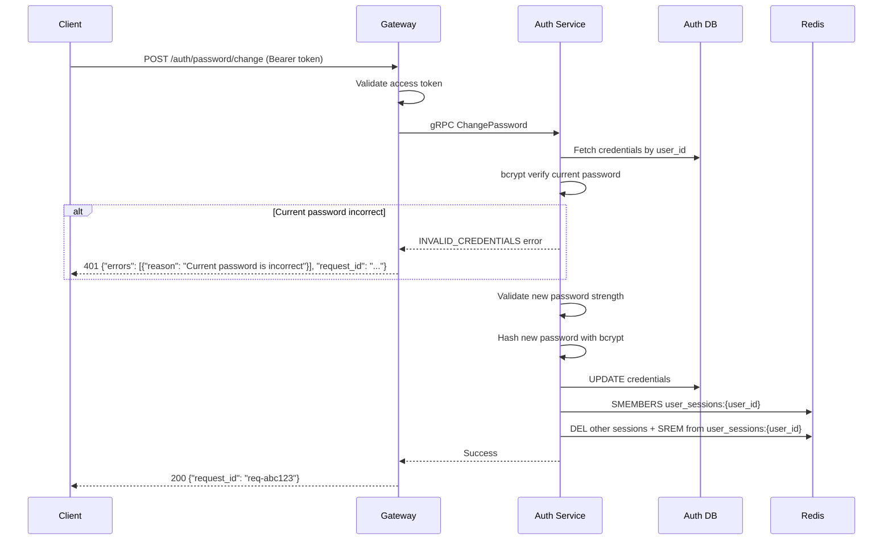

#### 11.5.2 Send Password Reset Code

`POST /api/v1/auth/password/reset/send-code`

- **Access:** Public
- **Idempotency:** Recommended
- **Description:** Sends a 6-digit verification code for password reset. Always returns success to prevent user enumeration.

**Request Body:**

```json
{
  "identifier": "user@example.com"
}
```

| Field        | Type   | Required | Validation                              |
| ------------ | ------ | -------- | --------------------------------------- |
| `identifier` | string | Yes      | Valid email or E.164 phone number       |

**Success Response (200):**

```json
{
  "data": {
    "expires_in": 600
  },
  "request_id": "req-abc123"
}
```

**Error Responses:**

| HTTP Status | errors                      |
| ----------- | ----------------------------------- |
| 400         | Invalid identifier format           |
| 429         | Too many verification code requests |

**Sequence Diagram:**

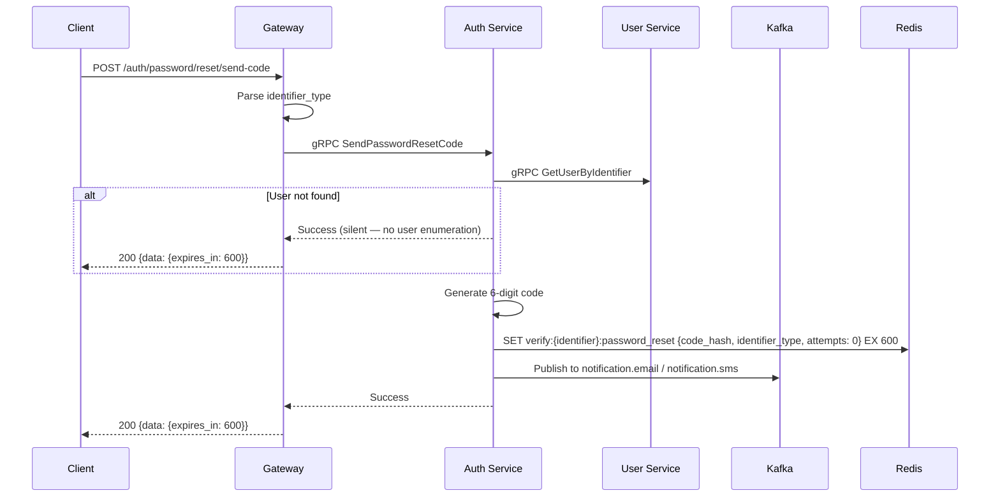

#### 11.5.3 Reset Password

`POST /api/v1/auth/password/reset`

- **Access:** Public
- **Idempotency:** Required
- **Description:** Resets the user's password using a verification code. Invalidates all existing sessions.

**Request Body:**

```json
{
  "identifier": "user@example.com",
  "code": "123456",
  "new_password": "MyNewPass456"
}
```

| Field          | Type   | Required | Validation                                      |
| -------------- | ------ | -------- | ----------------------------------------------- |
| `identifier`   | string | Yes      | Valid email or E.164 phone number               |
| `code`         | string | Yes      | 6-digit numeric string                          |
| `new_password` | string | Yes      | 8–72 chars, must include upper + lower + digit |

**Success Response (200):**

```json
{
  "request_id": "req-abc123"
}
```

**Error Responses:**

| HTTP Status | errors                      |
| ----------- | ----------------------------------- |
| 400         | Invalid verification code           |
| 400         | Password does not meet requirements |
| 400         | Validation error                    |

**Sequence Diagram:**

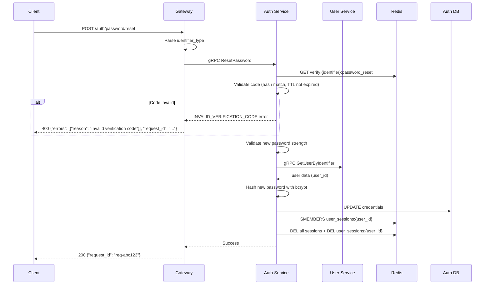

### 11.6 Profile Management

#### 11.6.1 Get Current User Profile

`GET /api/v1/users/me`

- **Access:** Protected (user)
- **Idempotency:** N/A (GET)
- **Description:** Returns the authenticated user's full profile information.

**Success Response (200):**

```json
{
  "data": {
    "user_id": "550e8400-e29b-41d4-a716-446655440000",
    "email": "user@example.com",
    "phone": null,
    "nickname": "John",
    "avatar_url": "https://cdn.nihao.chat/avatars/550e8400.jpg",
    "bio": "Hello world!",
    "created_at": "2026-01-15T10:30:00Z"
  },
  "request_id": "req-abc123"
}
```

**Error Responses:**

| HTTP Status | errors |
| ----------- | -------------- |
| 401         | Unauthorized   |
| 404         | User not found |

**Sequence Diagram:**

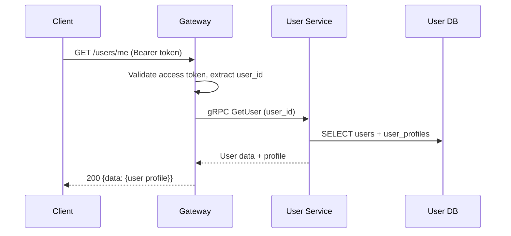

#### 11.6.2 Update Current User Profile

`PATCH /api/v1/users/me`

- **Access:** Protected (user)
- **Idempotency:** Recommended
- **Description:** Updates the authenticated user's profile fields. Only provided fields are updated.

**Request Body:**

```json
{
  "nickname": "NewNick",
  "bio": "Updated bio"
}
```

| Field      | Type   | Required | Validation                |
| ---------- | ------ | -------- | ------------------------- |
| `nickname` | string | No       | 1–30 characters if provided |
| `bio`      | string | No       | 0–200 characters if provided |

**Success Response (200):**

```json
{
  "data": {
    "user_id": "550e8400-e29b-41d4-a716-446655440000",
    "nickname": "NewNick",
    "bio": "Updated bio"
  },
  "request_id": "req-abc123"
}
```

**Error Responses:**

| HTTP Status | errors             |
| ----------- | -------------------------- |
| 400         | Invalid nickname           |
| 400         | Bio exceeds maximum length |
| 401         | Unauthorized               |
| 404         | User not found             |

**Sequence Diagram:**

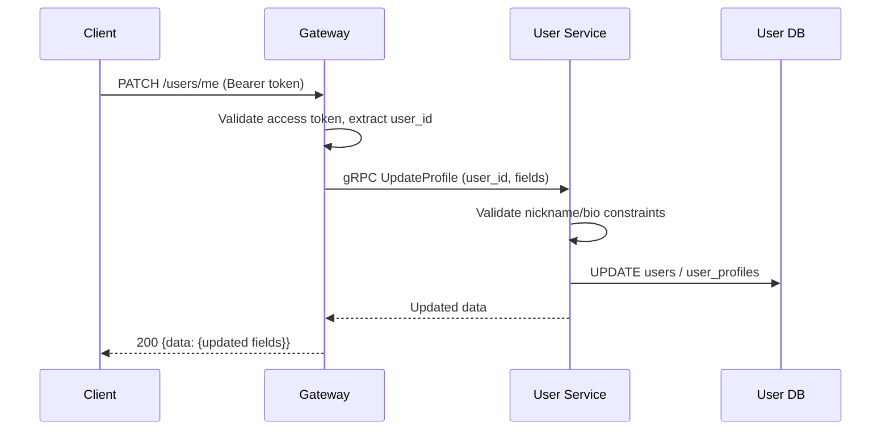

#### 11.6.3 Get User Public Profile

`GET /api/v1/users/:id/profile`

- **Access:** Protected (user)
- **Idempotency:** N/A (GET)
- **Description:** Returns the public profile of a user by their ID.

**Path Parameters:**

| Parameter | Type   | Description |
| --------- | ------ | ----------- |
| `id`      | UUID   | User ID     |

**Success Response (200):**

```json
{
  "data": {
    "user_id": "550e8400-e29b-41d4-a716-446655440000",
    "nickname": "John",
    "avatar_url": "https://cdn.nihao.chat/avatars/550e8400.jpg",
    "bio": "Hello world!"
  },
  "request_id": "req-abc123"
}
```

**Error Responses:**

| HTTP Status | errors |
| ----------- | -------------- |
| 401         | Unauthorized   |
| 404         | User not found |

**Sequence Diagram:**

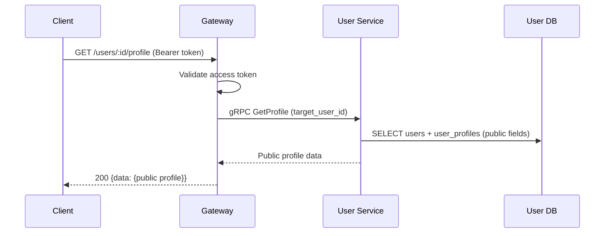

### 11.7 Avatar Management

#### 11.7.1 Generate Avatar Presigned POST URL

`POST /api/v1/users/me/avatar/presigned`

- **Access:** Protected (user)
- **Idempotency:** Not required
- **Description:** Generates a presigned POST URL for uploading an avatar image directly to S3/MinIO.

**Request Body:**

```json
{
  "content_type": "image/jpeg",
  "content_length": 204800
}
```

| Field            | Type    | Required | Validation                                   |
| ---------------- | ------- | -------- | -------------------------------------------- |
| `content_type`   | string  | Yes      | `image/jpeg`, `image/png`, or `image/webp`   |
| `content_length` | integer | Yes      | 1 – 5242880 bytes (5 MB)                     |

**Success Response (200):**

```json
{
  "data": {
    "url": "https://s3.example.com/avatars",
    "fields": {
      "key": "avatars/550e8400-e29b-41d4-a716-446655440000/avatar.jpg",
      "policy": "eyJleH...",
      "x-amz-algorithm": "AWS4-HMAC-SHA256",
      "x-amz-credential": "...",
      "x-amz-date": "20260214T000000Z",
      "x-amz-signature": "..."
    }
  },
  "request_id": "req-abc123"
}
```

**Error Responses:**

| HTTP Status | errors        |
| ----------- | --------------------- |
| 400         | Invalid avatar format |
| 400         | Avatar too large      |
| 401         | Unauthorized          |

**Sequence Diagram:**

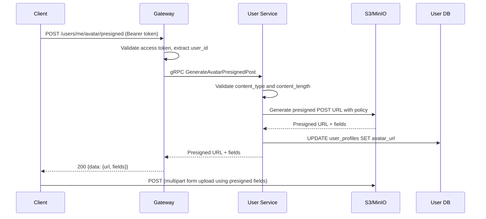

#### 11.7.2 Delete Avatar

`DELETE /api/v1/users/me/avatar`

- **Access:** Protected (user)
- **Idempotency:** Not required
- **Description:** Removes the current user's avatar image.

**Success Response (200):**

```json
{
  "request_id": "req-abc123"
}
```

**Error Responses:**

| HTTP Status | errors   |
| ----------- | ---------------- |
| 401         | Unauthorized     |
| 404         | Avatar not found |

**Sequence Diagram:**

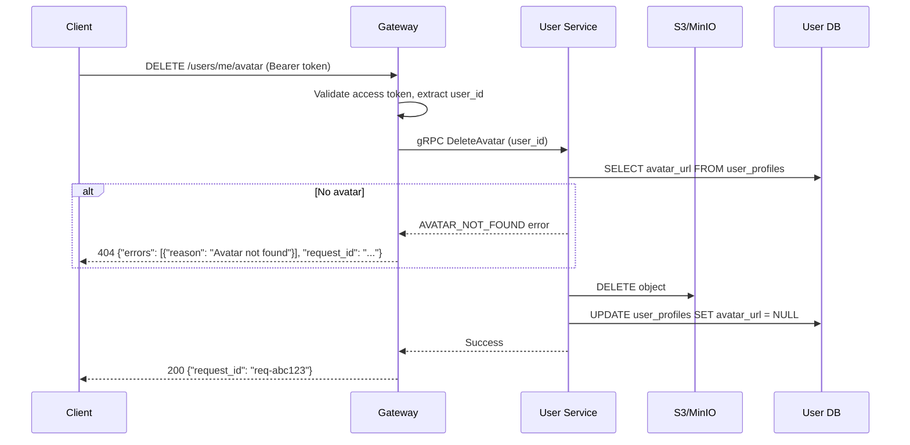

## 12. Operational Endpoints

### 12.1 Health Check — Liveness

`GET /healthz`

- **Access:** Public (infrastructure only, not exposed to clients)
- **Description:** Indicates the gateway process is running.

**Response (200):**

```json
{
  "status": "ok"
}
```

### 12.2 Health Check — Readiness

`GET /ready`

- **Access:** Public (infrastructure only)
- **Description:** Indicates the gateway and its dependencies are ready to serve traffic.

**Response (200):**

```json
{
  "status": "ready",
  "checks": {
    "auth_service": "up",
    "user_service": "up",
    "redis": "up"
  }
}
```

**Response (503):**

```json
{
  "status": "not_ready",
  "checks": {
    "auth_service": "up",
    "user_service": "down",
    "redis": "up"
  }
}
```

### 12.3 Metrics

`GET /metrics`

- **Access:** Public (infrastructure only, typically scraped by Prometheus)
- **Description:** Exposes Prometheus-compatible metrics.

## 13. API Summary

| Method   | Endpoint                                  | Access    | Service      | Idempotency  | Description                              |
| -------- | ----------------------------------------- | --------- | ------------ | ------------ | ---------------------------------------- |
| `POST`   | `/api/v1/auth/register/send-code`         | Public    | auth-service | Recommended  | Send registration verification code      |
| `POST`   | `/api/v1/auth/register`                   | Public    | auth-service | Required     | Complete user registration               |
| `POST`   | `/api/v1/auth/login`                      | Public    | auth-service | —            | Login with email/phone + password        |
| `POST`   | `/api/v1/auth/login/google`               | Public    | auth-service | —            | Login with Google OAuth                  |
| `POST`   | `/api/v1/auth/login/apple`                | Public    | auth-service | —            | Login with Apple Sign-In                 |
| `POST`   | `/api/v1/auth/token/refresh`              | Public    | auth-service | —            | Refresh access token                     |
| `POST`   | `/api/v1/auth/logout`                     | Protected | auth-service | —            | Logout and revoke session                |
| `POST`   | `/api/v1/auth/password/change`            | Protected | auth-service | Recommended  | Change password                          |
| `POST`   | `/api/v1/auth/password/reset/send-code`   | Public    | auth-service | Recommended  | Send password reset verification code    |
| `POST`   | `/api/v1/auth/password/reset`             | Public    | auth-service | Required     | Reset password with verification code    |
| `GET`    | `/api/v1/users/me`                        | Protected | user-service | —            | Get current user profile                 |
| `PATCH`  | `/api/v1/users/me`                        | Protected | user-service | Recommended  | Update current user profile              |
| `GET`    | `/api/v1/users/:id/profile`               | Protected | user-service | —            | Get user public profile                  |
| `POST`   | `/api/v1/users/me/avatar/presigned`       | Protected | user-service | —            | Generate avatar upload presigned URL     |
| `DELETE` | `/api/v1/users/me/avatar`                 | Protected | user-service | —            | Delete avatar                            |
