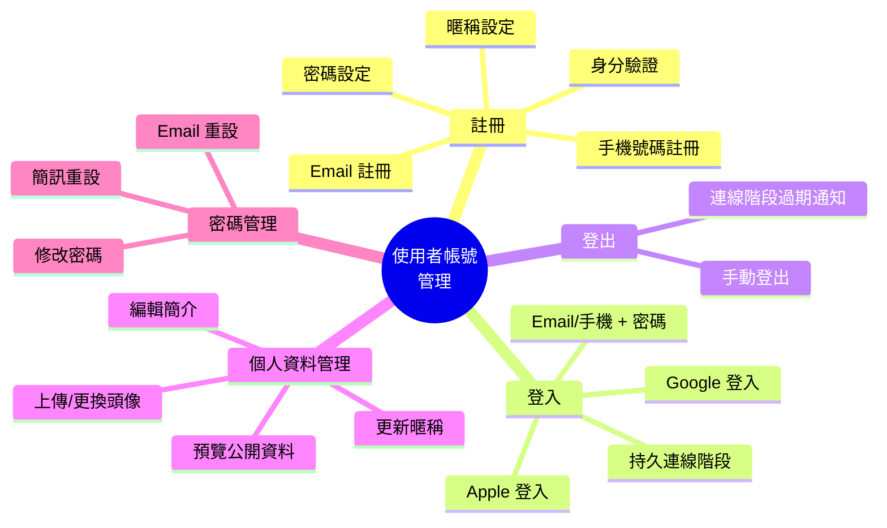
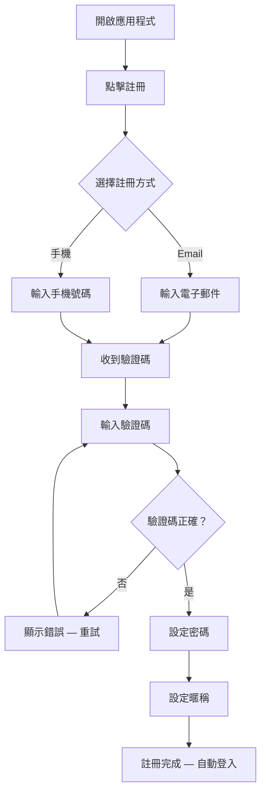
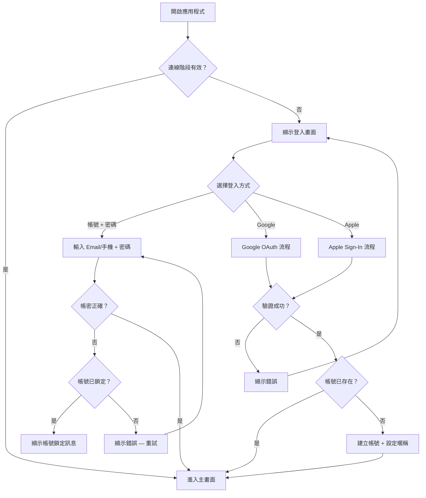
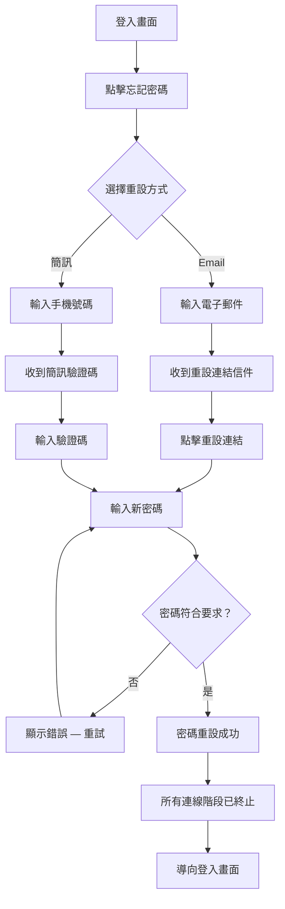
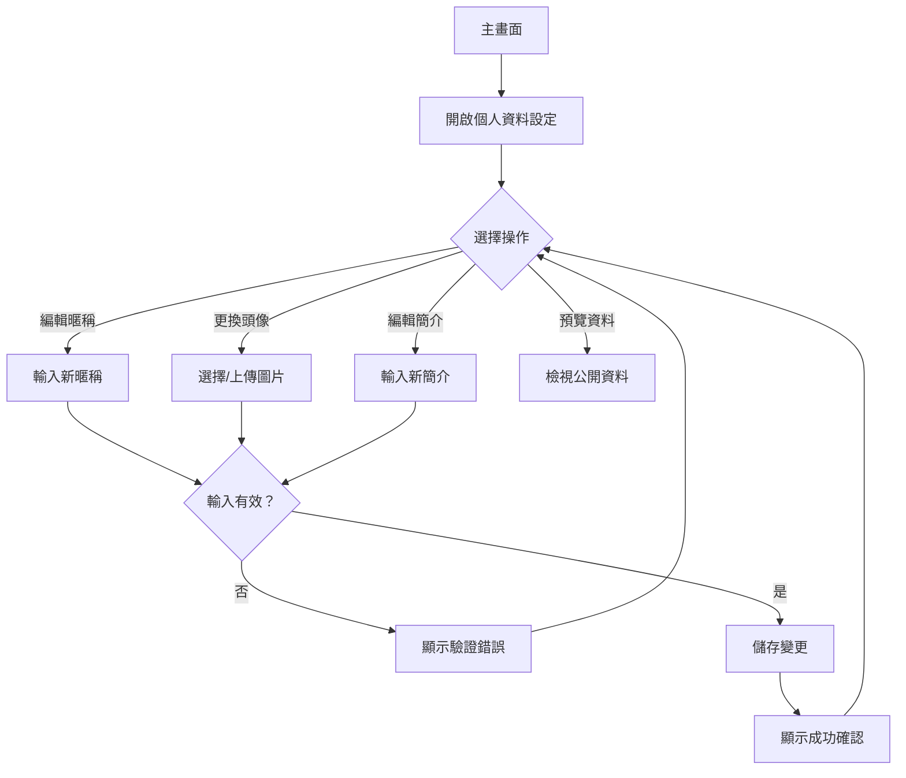
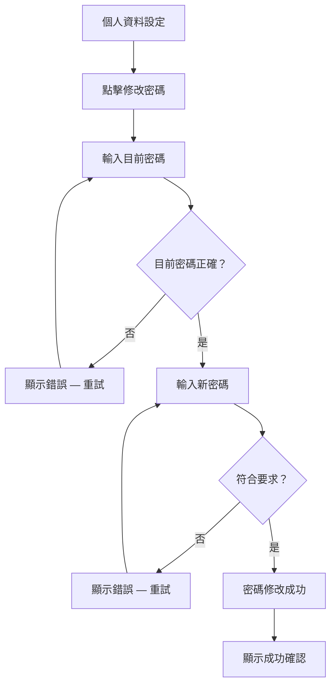

# FEAT-USER-001：使用者帳號管理

| 欄位         | 值               |
| ------------ | ---------------- |
| **功能編號** | `FEAT-USER-001`  |
| **產品**     | nihao-chat       |
| **作者**     | AI model         |
| **建立日期** | 2026-02-14       |
| **版本**     | 1.0              |

---

## 1. 概述

nihao-chat 是一款即時通訊應用程式。在使用者能夠開始通訊之前，他們需要一種安全且流暢的方式來建立帳號、驗證身分及管理個人資訊。**FEAT-USER-001** 涵蓋完整的使用者帳號生命週期 — 從註冊、登入到登出、個人資料管理及密碼管理。此功能為應用程式中所有其他面向使用者的功能奠定基礎。

## 2. 目標與指標

| #  | 目標                                | 成功指標                                                       |
| -- | ----------------------------------- | -------------------------------------------------------------- |
| 1  | 讓新使用者能快速完成註冊             | 90% 的註冊嘗試成功完成                                          |
| 2  | 提供安全且靈活的身分驗證方式          | 支援帳密登入及社群登入，且零重大安全漏洞                          |
| 3  | 讓使用者能管理個人身分資訊            | 80% 的使用者在第一週內完成個人資料設定                            |
| 4  | 提供可靠的密碼找回機制               | 95% 的密碼重設請求在 5 分鐘內完成                                |
| 5  | 確保流暢的連線階段管理               | 使用者在所有平台上皆能順利登入和登出                              |

## 3. 目標使用者

- **新使用者** — 首次下載 nihao-chat 並需要建立帳號才能開始聊天的人。
- **回訪使用者** — 已有帳號的使用者，需要登入、管理個人資料或找回密碼。
- **社群登入使用者** — 偏好透過第三方服務（Google、Apple）進行身分驗證的使用者，而非建立專屬密碼。

## 4. 使用者故事

### 4.1 註冊

| 編號   | 使用者故事                                                                                          |
| ------ | --------------------------------------------------------------------------------------------------- |
| US-001 | 身為新使用者，我想使用電子郵件註冊，以便用我的信箱建立帳號。                                            |
| US-002 | 身為新使用者，我想使用手機號碼註冊，以便用我的手機號碼建立帳號。                                        |
| US-003 | 身為新使用者，我想在註冊時驗證我的電子郵件或手機號碼，以便確保帳號安全。                                  |
| US-004 | 身為新使用者，我想在註冊時設定密碼，以便日後可以登入。                                                  |
| US-005 | 身為新使用者，我想在註冊時設定暱稱，以便其他使用者可以辨識我。                                          |

### 4.2 登入

| 編號   | 使用者故事                                                                                          |
| ------ | --------------------------------------------------------------------------------------------------- |
| US-006 | 身為回訪使用者，我想使用電子郵件/手機號碼和密碼登入，以便存取我的帳號。                                  |
| US-007 | 身為使用者，我想使用 Google 帳號登入，以便不需要另外記住密碼就能驗證身分。                                |
| US-008 | 身為使用者，我想使用 Apple 帳號登入，以便快速且隱私地完成驗證。                                          |
| US-009 | 身為使用者，我想在跨連線階段時保持登入狀態，以便不需要每次都重新輸入帳密。                                |

### 4.3 登出

| 編號   | 使用者故事                                                                                          |
| ------ | --------------------------------------------------------------------------------------------------- |
| US-010 | 身為已登入的使用者，我想登出帳號，以便終止此裝置上的連線階段。                                          |
| US-011 | 身為使用者，我想在連線階段過期時收到通知，以便知道需要重新登入。                                         |

### 4.4 個人資料管理

| 編號   | 使用者故事                                                                                          |
| ------ | --------------------------------------------------------------------------------------------------- |
| US-012 | 身為使用者，我想更新暱稱，以便改變他人看到我的方式。                                                    |
| US-013 | 身為使用者，我想上傳或更換頭像，以便在應用程式中擁有視覺化的身分識別。                                    |
| US-014 | 身為使用者，我想編輯個人簡介，以便讓他人更了解我。                                                      |
| US-015 | 身為使用者，我想預覽他人眼中的我的資料，以便確認公開資訊的呈現。                                         |

### 4.5 密碼管理

| 編號   | 使用者故事                                                                                          |
| ------ | --------------------------------------------------------------------------------------------------- |
| US-016 | 身為使用者，我想修改密碼，以便保持帳號安全。                                                            |
| US-017 | 身為忘記密碼的使用者，我想透過電子郵件連結重設密碼，以便重新取得帳號存取權。                                |
| US-018 | 身為忘記密碼的使用者，我想透過簡訊驗證碼重設密碼，以便重新取得帳號存取權。                                  |

## 5. 功能需求

### 5.1 註冊

| 編號   | 需求                                                                                                |
| ------ | --------------------------------------------------------------------------------------------------- |
| FR-001 | 系統應允許使用者使用電子郵件或手機號碼進行註冊。                                                        |
| FR-002 | 系統應在註冊過程中向使用者提供的電子郵件或手機號碼發送驗證碼。                                            |
| FR-003 | 系統應要求使用者輸入驗證碼以完成註冊。                                                                  |
| FR-004 | 系統應要求使用者在註冊時設定符合最低安全標準的密碼。                                                      |
| FR-005 | 系統應要求使用者在註冊時提供暱稱。                                                                      |
| FR-006 | 系統應防止使用相同電子郵件或手機號碼進行重複註冊。                                                        |
| FR-007 | 系統應在註冊失敗時顯示清楚的錯誤訊息（如重複帳號、輸入無效等）。                                          |

### 5.2 登入

| 編號   | 需求                                                                                                |
| ------ | --------------------------------------------------------------------------------------------------- |
| FR-008 | 系統應允許使用者使用已註冊的電子郵件或手機號碼及密碼進行登入。                                            |
| FR-009 | 系統應支援 Google OAuth 登入。                                                                        |
| FR-010 | 系統應支援 Apple Sign-In 登入。                                                                       |
| FR-011 | 系統應維持持久連線階段，使使用者在重新啟動應用程式後仍保持登入狀態。                                       |
| FR-012 | 系統應在連續登入失敗達到可設定的次數後，暫時鎖定帳號。                                                    |
| FR-013 | 系統應在登入失敗時顯示清楚的錯誤訊息（如密碼錯誤、帳號已鎖定等）。                                        |

### 5.3 登出

| 編號   | 需求                                                                                                |
| ------ | --------------------------------------------------------------------------------------------------- |
| FR-014 | 系統應允許已登入的使用者登出，並終止當前的連線階段。                                                      |
| FR-015 | 系統應在登出時清除所有本機連線階段資料。                                                                  |
| FR-016 | 系統應在連線階段過期時通知使用者，並將其導向登入畫面。                                                    |

### 5.4 個人資料管理

| 編號   | 需求                                                                                                |
| ------ | --------------------------------------------------------------------------------------------------- |
| FR-017 | 系統應允許使用者更新暱稱。                                                                              |
| FR-018 | 系統應允許使用者上傳、更換或移除頭像圖片。                                                                |
| FR-019 | 系統應允許使用者編輯個人簡介。                                                                          |
| FR-020 | 系統應允許使用者預覽其他人看到的個人資料樣貌。                                                            |
| FR-021 | 系統應驗證暱稱不得為空且不超過最大字元數限制。                                                            |
| FR-022 | 系統應驗證頭像圖片符合大小及格式要求。                                                                    |

### 5.5 密碼管理

| 編號   | 需求                                                                                                |
| ------ | --------------------------------------------------------------------------------------------------- |
| FR-023 | 系統應在驗證使用者目前密碼後，允許使用者修改密碼。                                                        |
| FR-024 | 系統應允許使用者透過電子郵件連結請求密碼重設。                                                            |
| FR-025 | 系統應允許使用者透過簡訊驗證碼請求密碼重設。                                                              |
| FR-026 | 系統應在可設定的時間期限後使密碼重設連結/驗證碼失效。                                                      |
| FR-027 | 系統應強制執行密碼強度要求（最小長度、複雜度）。                                                          |
| FR-028 | 系統應在密碼重設成功後終止所有現有的連線階段。                                                            |

## 6. 非功能性需求

| 編號   | 類別     | 需求                                                                                    |
| ------ | -------- | --------------------------------------------------------------------------------------- |
| NFR-01 | 安全性   | 系統應使用業界標準的雜湊演算法儲存密碼。                                                     |
| NFR-02 | 安全性   | 系統應透過加密連線傳輸所有身分驗證資料。                                                     |
| NFR-03 | 安全性   | 系統應對登入、註冊及密碼重設端點實施速率限制。                                                 |
| NFR-04 | 安全性   | 系統應防範常見攻擊手法（暴力破解、憑證填充）。                                                 |
| NFR-05 | 效能     | 系統應在正常負載下於 3 秒內完成登入和註冊作業。                                               |
| NFR-06 | 效能     | 系統應在 30 秒內送達驗證碼（電子郵件/簡訊）。                                                 |
| NFR-07 | 易用性   | 系統應為所有失敗情境提供清楚且友善的錯誤訊息。                                                 |
| NFR-08 | 易用性   | 系統應在行動裝置（iOS/Android）及網頁端皆支援註冊和登入流程。                                   |
| NFR-09 | 可用性   | 身分驗證服務應維持 99.9% 的正常運作時間。                                                     |
| NFR-10 | 合規性   | 系統應遵守處理個人資訊的相關資料隱私法規。                                                     |

## 7. 使用者流程圖

### 7.1 註冊流程

### 7.2 登入流程

### 7.3 忘記密碼流程

### 7.4 個人資料管理流程

### 7.5 修改密碼流程

## 8. 不在範圍內

- **雙重驗證（2FA）** — 可能在未來版本中考慮。
- **帳號刪除** — 將在另一個功能中處理。
- **多裝置連線階段管理** — 跨裝置查看和管理連線階段不包含在此版本中。
- **使用者名稱/帳號代號系統** — 使用者僅透過暱稱識別；可搜尋的唯一帳號代號不屬於此功能範圍。
- **變更電子郵件/手機號碼** — 更改已註冊的電子郵件或手機號碼不包含在此版本中。
- **管理員使用者管理** — 用於管理使用者帳號的後台管理工具不在範圍內。

## 9. 待確認問題

| #  | 問題                                                                        | 狀態   |
| -- | --------------------------------------------------------------------------- | ------ |
| 1  | 密碼強度的具體要求為何（最小長度、特殊字元）？                                   | 待確認 |
| 2  | 連續登入失敗後的帳號鎖定時間應為多久？                                          | 待確認 |
| 3  | 密碼重設連結/驗證碼的有效期限應為多久？                                          | 待確認 |
| 4  | 頭像圖片的最大檔案大小及支援格式為何？                                           | 待確認 |
| 5  | 暱稱和個人簡介的最大字元數限制為何？                                              | 待確認 |
| 6  | 透過社群登入且沒有密碼的使用者是否應被提示設定密碼？                                | 待確認 |

## 10. 修訂紀錄

| 版本 | 日期       | 作者     | 變更內容   |
| ---- | ---------- | -------- | ---------- |
| 1.0  | 2026-02-14 | AI model | 初始草稿   |
