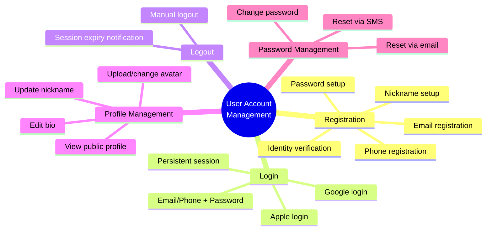
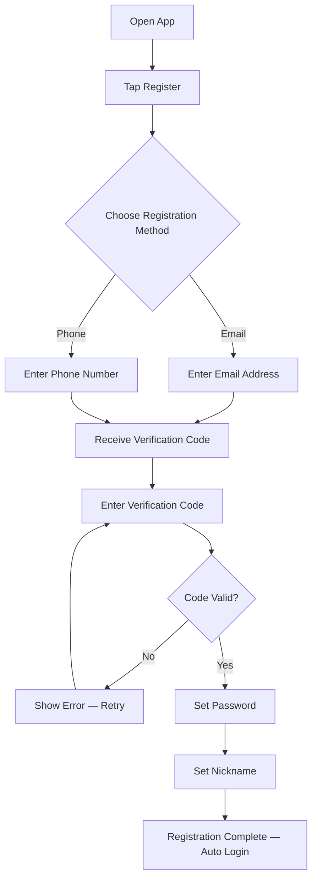
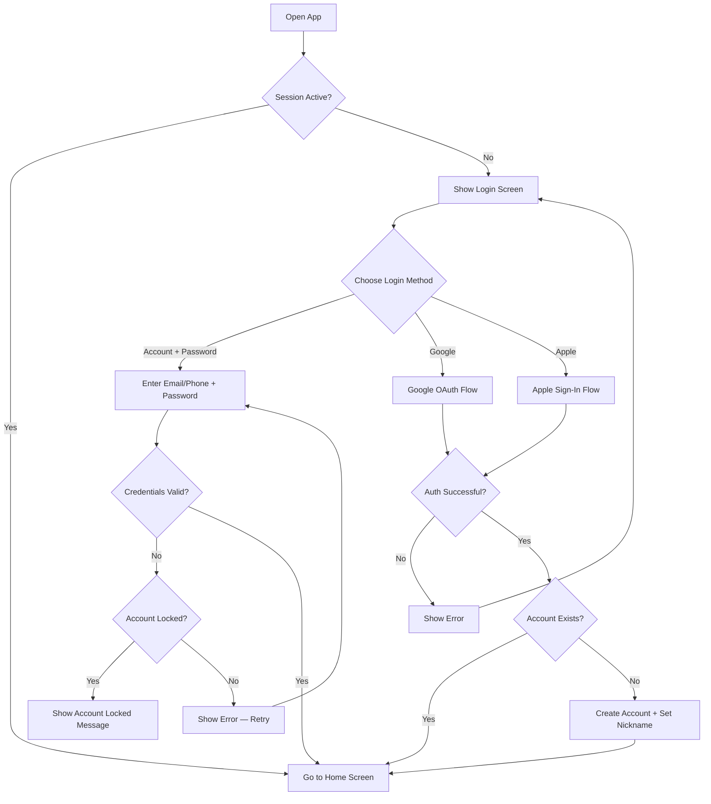
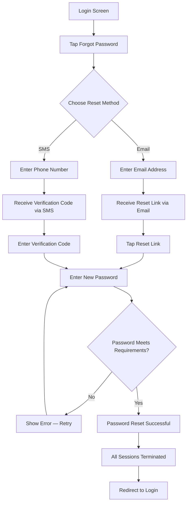
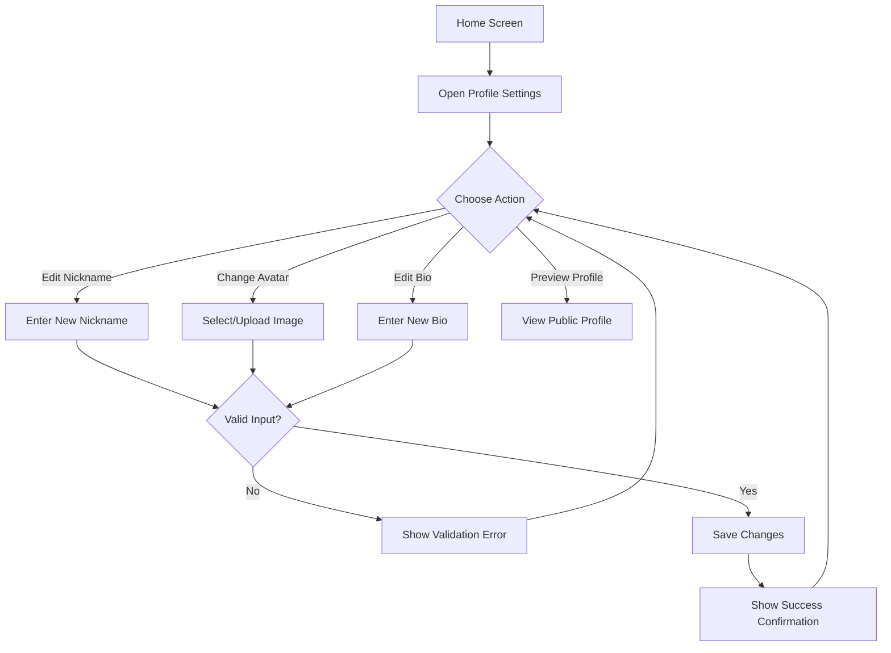
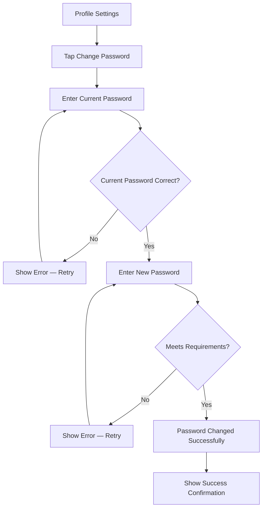

# FEAT-USER-001: User Account Management

| Field          | Value            |
| -------------- | ---------------- |
| **Feature ID** | `FEAT-USER-001`  |
| **Product**    | nihao-chat       |
| **Author**     | AI model         |
| **Created**    | 2026-02-14       |
| **Version**    | 1.0              |

---

## 1. Overview

nihao-chat is an instant messaging application. Before users can communicate, they need a secure and streamlined way to create accounts, authenticate, and manage their identity. **FEAT-USER-001** covers the full user account lifecycle — from registration and login to logout, profile management, and password management. This feature lays the foundation for all other user-facing functionality in the app.

## 2. Goals & Objectives

| #  | Objective                                       | Success Metric                                                    |
| -- | ----------------------------------------------- | ----------------------------------------------------------------- |
| 1  | Enable new users to register quickly             | 90% of registration attempts complete successfully                |
| 2  | Provide secure and flexible authentication       | Support account-password and social login with zero critical vulnerabilities |
| 3  | Allow users to manage their personal identity    | 80% of users complete their profile within the first week         |
| 4  | Offer reliable password recovery                 | 95% of password reset requests resolved within 5 minutes          |
| 5  | Ensure smooth session management                 | Users can log in and log out without errors across all platforms   |

## 3. Target Users

- **New Users** — People downloading nihao-chat for the first time who need to create an account to start messaging.
- **Returning Users** — Existing users who need to log in, manage their profile, or recover their password.
- **Social Login Users** — Users who prefer to authenticate via third-party providers (Google, Apple) instead of creating a dedicated password.

## 4. User Stories

### 4.1 Registration

| ID     | User Story                                                                                                        |
| ------ | ----------------------------------------------------------------------------------------------------------------- |
| US-001 | As a new user, I want to register with my email address so that I can create an account using my email.            |
| US-002 | As a new user, I want to register with my phone number so that I can create an account using my mobile number.     |
| US-003 | As a new user, I want to verify my email or phone number during registration so that my account is secure.         |
| US-004 | As a new user, I want to set a password during registration so that I can log in later.                            |
| US-005 | As a new user, I want to set a nickname during registration so that other users can identify me.                   |

### 4.2 Login

| ID     | User Story                                                                                                        |
| ------ | ----------------------------------------------------------------------------------------------------------------- |
| US-006 | As a returning user, I want to log in with my email/phone and password so that I can access my account.            |
| US-007 | As a user, I want to log in with my Google account so that I can authenticate without a separate password.          |
| US-008 | As a user, I want to log in with my Apple account so that I can authenticate quickly and privately.                 |
| US-009 | As a user, I want to stay logged in across sessions so that I don't have to re-enter credentials every time.       |

### 4.3 Logout

| ID     | User Story                                                                                                        |
| ------ | ----------------------------------------------------------------------------------------------------------------- |
| US-010 | As a logged-in user, I want to log out of my account so that my session is terminated on this device.              |
| US-011 | As a user, I want to be informed when my session expires so that I know I need to log in again.                    |

### 4.4 Profile Management

| ID     | User Story                                                                                                        |
| ------ | ----------------------------------------------------------------------------------------------------------------- |
| US-012 | As a user, I want to update my nickname so that I can change how others see me.                                    |
| US-013 | As a user, I want to upload or change my avatar so that I have a visual identity in the app.                       |
| US-014 | As a user, I want to edit my personal bio so that others can learn more about me.                                  |
| US-015 | As a user, I want to view my profile as others see it so that I can verify my public information.                  |

### 4.5 Password Management

| ID     | User Story                                                                                                        |
| ------ | ----------------------------------------------------------------------------------------------------------------- |
| US-016 | As a user, I want to change my password so that I can keep my account secure.                                      |
| US-017 | As a user who forgot my password, I want to reset it via an email link so that I can regain access to my account.  |
| US-018 | As a user who forgot my password, I want to reset it via an SMS verification code so that I can regain access.     |

## 5. Functional Requirements

### 5.1 Registration

| ID     | Requirement                                                                                                       |
| ------ | ----------------------------------------------------------------------------------------------------------------- |
| FR-001 | The system shall allow users to register using an email address or a phone number.                                 |
| FR-002 | The system shall send a verification code to the provided email or phone number during registration.               |
| FR-003 | The system shall require the user to enter the verification code to complete registration.                         |
| FR-004 | The system shall require the user to set a password that meets minimum security criteria during registration.       |
| FR-005 | The system shall require the user to provide a nickname during registration.                                        |
| FR-006 | The system shall prevent duplicate registrations with the same email or phone number.                              |
| FR-007 | The system shall display clear error messages when registration fails (e.g., duplicate account, invalid input).     |

### 5.2 Login

| ID     | Requirement                                                                                                       |
| ------ | ----------------------------------------------------------------------------------------------------------------- |
| FR-008 | The system shall allow users to log in with their registered email or phone number and password.                    |
| FR-009 | The system shall support Google OAuth login.                                                                        |
| FR-010 | The system shall support Apple Sign-In.                                                                             |
| FR-011 | The system shall maintain a persistent session so that users remain logged in across app restarts.                  |
| FR-012 | The system shall lock the account temporarily after a configurable number of consecutive failed login attempts.      |
| FR-013 | The system shall display clear error messages for failed login attempts (e.g., wrong password, account locked).      |

### 5.3 Logout

| ID     | Requirement                                                                                                       |
| ------ | ----------------------------------------------------------------------------------------------------------------- |
| FR-014 | The system shall allow logged-in users to log out, terminating the current session.                                |
| FR-015 | The system shall clear all local session data upon logout.                                                          |
| FR-016 | The system shall notify the user when their session has expired and redirect them to the login screen.              |

### 5.4 Profile Management

| ID     | Requirement                                                                                                       |
| ------ | ----------------------------------------------------------------------------------------------------------------- |
| FR-017 | The system shall allow users to update their nickname.                                                              |
| FR-018 | The system shall allow users to upload, change, or remove their avatar image.                                       |
| FR-019 | The system shall allow users to edit their personal bio.                                                            |
| FR-020 | The system shall allow users to preview their profile as it appears to other users.                                 |
| FR-021 | The system shall validate that nicknames are non-empty and within a maximum character limit.                        |
| FR-022 | The system shall validate that avatar images meet size and format requirements.                                     |

### 5.5 Password Management

| ID     | Requirement                                                                                                       |
| ------ | ----------------------------------------------------------------------------------------------------------------- |
| FR-023 | The system shall allow users to change their password after verifying their current password.                       |
| FR-024 | The system shall allow users to request a password reset via an email link.                                         |
| FR-025 | The system shall allow users to request a password reset via an SMS verification code.                              |
| FR-026 | The system shall expire password reset links/codes after a configurable time period.                                |
| FR-027 | The system shall enforce password strength requirements (minimum length, complexity).                               |
| FR-028 | The system shall terminate all existing sessions after a successful password reset.                                  |

## 6. Non-Functional Requirements

| ID     | Category      | Requirement                                                                                          |
| ------ | ------------- | ---------------------------------------------------------------------------------------------------- |
| NFR-01 | Security      | The system shall store passwords using industry-standard hashing algorithms.                          |
| NFR-02 | Security      | The system shall transmit all authentication data over encrypted connections.                          |
| NFR-03 | Security      | The system shall implement rate limiting on login, registration, and password reset endpoints.         |
| NFR-04 | Security      | The system shall protect against common attack vectors (brute force, credential stuffing).             |
| NFR-05 | Performance   | The system shall complete login and registration within 3 seconds under normal load.                  |
| NFR-06 | Performance   | The system shall deliver verification codes (email/SMS) within 30 seconds.                            |
| NFR-07 | Usability     | The system shall provide clear, user-friendly error messages for all failure scenarios.                |
| NFR-08 | Usability     | The system shall support the registration and login flow on both mobile (iOS/Android) and web.         |
| NFR-09 | Availability  | The authentication service shall maintain 99.9% uptime.                                               |
| NFR-10 | Compliance    | The system shall comply with applicable data privacy regulations for handling personal information.     |

## 7. User Flow Diagrams

### 7.1 Registration Flow

### 7.2 Login Flow

### 7.3 Forgot Password Flow

### 7.4 Profile Management Flow

### 7.5 Change Password Flow

## 8. Out of Scope

- **Two-factor authentication (2FA)** — May be considered in a future iteration.
- **Account deletion** — Will be addressed in a separate feature.
- **Multi-device session management** — Viewing and managing sessions across devices is not included.
- **Username/handle system** — Users are identified by nickname only; unique searchable handles are not part of this feature.
- **Email/phone number change** — Changing the registered email or phone is excluded from this iteration.
- **Admin user management** — Backend admin tools for managing user accounts are out of scope.

## 9. Open Questions

| #  | Question                                                                                              | Status |
| -- | ----------------------------------------------------------------------------------------------------- | ------ |
| 1  | What are the specific password strength requirements (minimum length, special characters)?              | Open   |
| 2  | How long should the account lockout last after consecutive failed login attempts?                       | Open   |
| 3  | What is the expiry time for password reset links/verification codes?                                   | Open   |
| 4  | What are the maximum file size and supported formats for avatar images?                                | Open   |
| 5  | What is the maximum character limit for nicknames and bios?                                            | Open   |
| 6  | Should social login users who have no password be prompted to set one?                                 | Open   |

## 10. Revision History

| Version | Date       | Author   | Changes       |
| ------- | ---------- | -------- | ------------- |
| 1.0     | 2026-02-14 | AI model | Initial draft |
